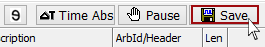
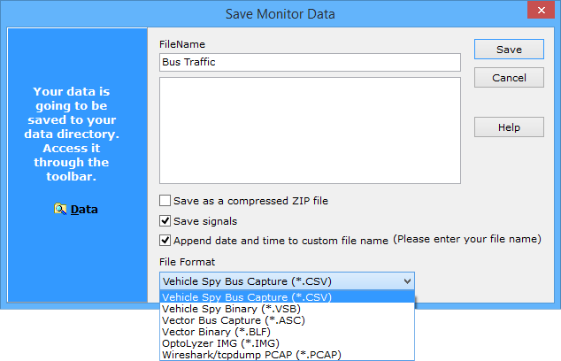

# Save the Buffer

Save the Messages view buffer by pressing the **Save** button in the top toolbar (Figure 1). Tapping predefined function key **F3 then S** will also work.

When the **Save** button is pressed, a dialog will appear allowing you to select file options (Figure 2).

The dialog provides a default **FileName** that can be changed if you prefer. The current **date and time** is added to the FileName if enabled by the checkbox.

A **text note** can be typed in the large field below the FileName. This note will get stored at the beginning of a .CSV format file. Descriptive text notes can be very helpful later when you or others are reviewing buffer files and trying to remember where the data came from or why it was saved at that time.

Enable the **Save as compressed ZIP file** checkbox to save the file in a compressed format. Signal data can be included in the buffer if **Save signals** is enabled and .CSV file format is chosen. Saving signal data in a .CSV file makes it larger, but it also means a database is not needed later to decode it.

The buffer file can be saved in a .CSV or .VSB **file format**, among others. .CSV (Comma Separated Value) is a common format that can be read by many applications and it can also include signal data and a text note. .VSB (Vehicle Spy Binary) format is readable by Vehicle Spy and does not include signal data or notes. .VSB files have smaller memory size than .CSV files, so .VSB format can be useful when saving very large message buffers.

When finished, click the **Save** button and the Messages buffer will be saved to your Data Directory.

\*Note:Press the **Enter** key as soon as the **Save** dialog appears to quickly save the buffer.

A buffer saved in Vehicle Spy can be analyzed, reviewed, used as a simulation file, played back onto physical networks, or converted to other formats.
