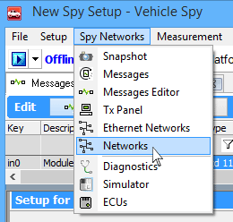

# Networks

Vehicle Spy can support more than one vehicle network at a time. Use the **Networks** view to change individual network properties and look at their statistics. To access this view select **Spy Networks**> **Networks** (**Figure 1**).

Use the Properties mode to set up network parameters such as custom descriptions, network hardware maps, baud rates, and database maps. Use the Statistics mode to display statistical information about each network while Vehicle Spy is running.

