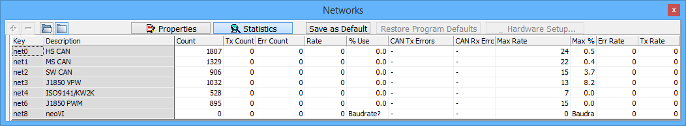

# Network Statistics

Statistics for a network can be seen in the Networks view by selecting the **Statistics** button (Figure 1). A description of each statistic is listed below in Table 1. All stats are cleared each time Vehicle Spy is started. While running, statistics can be cleared by right clicking on the description of the network to clear and selecting **Clear Stats**. Selecting the open folder  will change the view to show all networks, whereas selecting the closed folder  will hide unused networks.

| Network Statistic | Description                                                                                                                                             |
| ----------------- | ------------------------------------------------------------------------------------------------------------------------------------------------------- |
| Count             | Count of all messages for a network.                                                                                                                    |
| Tx Count          | Count of all messages transmitted by Vehicle Spy since start or statistics reset.                                                                       |
| Err Count         | Count of all network errors on the Vehicle network.                                                                                                     |
| Rate              | Current number of messages per second.                                                                                                                  |
| % Use             | 
The current amount of network bandwidth being used based on 0-100 percent scale. (You must enter a baud rate for this to function.)
           |
| CAN Tx Errors     | 
The number of errors in the CAN Tx Error Counters. (This must be supported by hardware. If unsupported there will be a - instead of a value.)
 |
| CAN Rx Errors     | 
The number of errors in the CAN Rx Error Counters. (This must be supported by hardware. If unsupported there will be a - instead of a value.)
 |
| Max Rate          | Maximum number of messages per second that have occurred since start or reset.                                                                          |
| Max %             | Maximum amount of network bandwidth used based on 0-100 percent scale since start or reset.                                                             |
| Error Rate        | The number of errors per second.                                                                                                                        |
| Tx Rate           | The number of transmitted messages per second.                                                                                                          |

