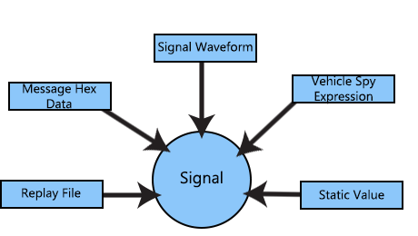
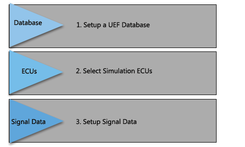
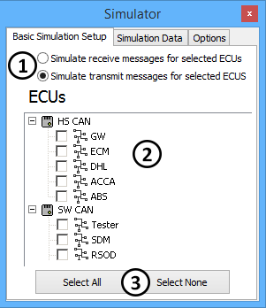
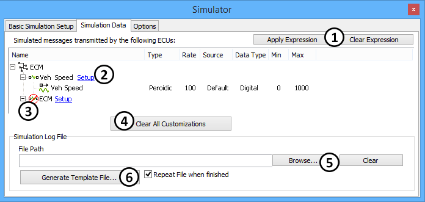
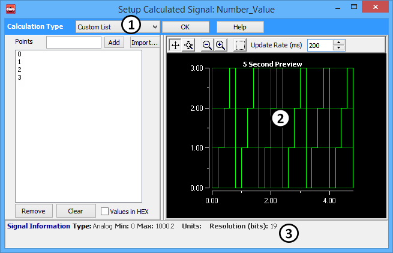
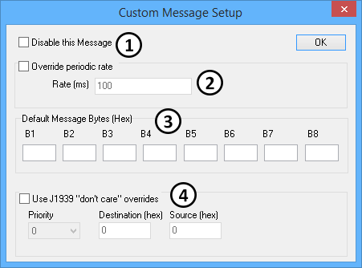
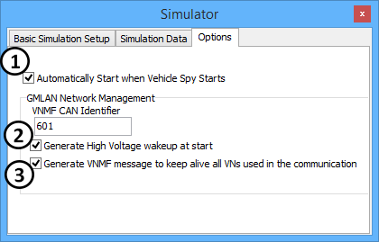

# Simulator

### Overview

The **Simulator** is designed to quickly simulate message traffic on a network. The simulator is easy to use, but is flexible enough for very complex simulations. The flexibility allows a user to generate complete interactive simulations with a handful of mouse clicks.\
\
The information required to setup the simulator is retrieved from the configured database. This database lists the ECUs involved in a particular network, the messages they transmit and signals present. If the configured database is a GMLAN UEF database, more information is available such as virtual networks involved, periodic message rates, and the ability to simulate receive messages for the selected ECUs.\
\
The simulated messages and signals can be sourced from the simulator or through the normal Vehicle Spy software transmit functions. Signal data can be entered automatically from static values, calculated functions, Vehicle Spy expressions, and saved replay files (Figure 1). Vehicle Spy features such as Graphical Panels, Function Blocks, and Java can provide the simulation with further options.

### Creating a Simulation

There are three main steps for creating a simulation (Figure 2).

### 1. Setup A UEF Database

### 2. Select Simulation ECUs:

The first tab in the simulator dialog, **Basic Simulation Setup,** allows selection of simulation type and what ECUs to simulate. The first choice is the type of simulator (Figure 3: ). If a GMLAN UEF Database is used with the GMLAN UEF simulator selection, transmit or receive messages can be simulated for selected ECUs. If any other database type is used, then Generic Simulator must be used. This type of simulation is only for transmitting messages from selected ECUs.\
\
Next, select the ECUs. You can select one or more ECUs for any networks you are simulating (Figure 3: ). To quickly select all or unselect all ECUs you can use the two buttons at the bottom of the dialog (Figure 3: ).

### 3. Modify the Simulation Messages and Signals:

After the ECUs are selected, the simulator will generate a list of messages and signals required for the simulation. The second tab in the simulator, **Simulation Data**, allows setup of the messages and signals used for the simulation (Figure 4).\
\
There are three ways to setup simulation data. The first option is to apply an expression to each signal (Figure 4: ) This expression can be a static value, a Vehicle Spy expression, or a signal generator function. Next assign hex data to the message as a whole. By clicking the **Setup** (Figure 4: ) hot link for a message it is possible to enter default hex bytes for the entire message. Finally, enter signal data from a replay file (Figure 4: ). Clear all of your setup for both messages and signals by clicking the **Clear All Customizations** button (Figure 4: ).\
\
Each signal indicates the type of signal trigger (event or periodic), the rate for the signal, the applied expression, the data type of the signal, and the min and max value where appropriate.\
\
Some messages appear in the list with a red line and circle **NO symbol** (Figure 4: ). This indicates that the message is disabled. Diagnostic messages are always disabled by the simulator. A user can manually disable any message in the message setup.\
\
The simulation log file allows injection of signal values into a simulation. This Excel .CSV file has columns for time and signal value. When the time for each row is met the simulator will assign the values in the rows to the signals in the simulation. To quickly generate a template file for use in Excel click the **Generate Template** button (Figure 4: ). This template will create a blank file with a header line with all of the signals used in the simulation. The log file created is compatible with the files saved in the Vehicle Spy logging and bus files that are converted.

Next, apply a custom expression to each signal in the simulation. Accomplish this by selecting one or more signals and clicking apply expression. When this has been done, the calculated signal dialog will appear (Figure 5). In this dialog setup the expression for the selected signals.\
\
The calculation type selection allows you to select one of the nine expression types (Figure 5: ). These expression types include: 1) Random, 2) Sinusoidal, 3) Ramp, 4) Triangle, 5) Square, 6) Custom List, 7) Equation 8) Static Value and 9)Remote Signal. The static value allows the user to enter a value that does not change. The Equation type allows the user to create a Vehicle Spy expression that can include data from other parts of Vehicle Spy. All of the other types are signal generator types. All parts of the signal generator can be controlled by an expression. The example waveform is shown in the right hand graph (Figure 5: ).

### Setup Message Options

Each message has setup options. In order to access the Custom Message Setup Dialog (Figure 6), click the hyperlinked blue Select next to the ECU in the Simulation Data tab. First, Disable this Message (Figure 6: ). This allows use of another part of Vehicle Spy to send this message. Next, override the periodic rate in the UEF file (Figure 6: ). For the Generic Simulator type, this must be specified or the message will not be sent. Each default message bytes can be enter manually (Figure 6: ). These message bytes are entered into the message prior to applying signals from an expression or file replay. Finally, Use J1939 "don't care" overrides can be set (Figure 6: ).

### Other Simulation Options

The simulator has a few settings that can be accessed from the options tab (Figure 7). First, disable the simulator so it does not automatically start when Vehicle Spy starts (Figure 7: ). This is useful when automating the simulator from a script and do not want the simulator to start until some initial conditions have been setup.\
\
The next group of settings has to do with network management for single wire CAN simulations. First, generate a high voltage wake up when the simulation starts (Figure 7: ). Second, you can have the simulator send out a VNMF message every three seconds with a specified ID (Figure 7: ). This VNMF message will activate all VNs except for the diagnostics VN.\
\
If needed, an OSEK type network management scheme can be used.  To enable this, Check the "Automatically perform OSEK\_NM for simulated nodes" check box (Figure 7: ).\
\
**Note**: It is possible the VNMF message the simulator sends out is not the most appropriate for your simulation. In these cases you can disable the simulator's VNMF and generate your own using Vehicle Spy function block scripts.

### Automating the Simulator 

The simulator can be fully automated via the Text API which is accessible through Java, Function Blocks, and external applications. Automatically setup, start, and stop the simulator as tests require.
