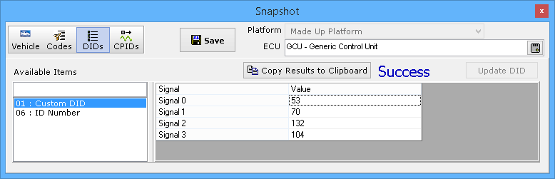

# Snapshot

[**Spy Networks**](./)**> Snapshot** is a tool that provides a fast and easy way for GMLAN and ISO 14229 users to perform simple diagnostic tasks. With the click of a button Snapshot can read and write DIDs, read and clear fault codes, or perform an entire bus query. For GMLAN, a button for CPIDs is available for ECU device control. If more advanced diagnostic actions are required then please refer to the [Diagnostics Setup](diagnostics/diagnostics-setup.md) screen.

Note: All figures on this page show Snapshot in GMLAN mode.

The Snapshot tool is directly affected by the OEM setting found on the [Tools](../main-menu-tools/) -> [Options](../main-menu-tools/tools-options/), [Spy Networks tab](../main-menu-tools/tools-options/options-spy-networks-tab/). Selecting GMLAN puts Snapshot in GMLAN mode. Selecting GGDS or HDLAN puts Snapshot into ISO 14229 mode.

The Snapshot tool uses four different views (Figure 1: ) to perform many different tasks (three views for ISO 14229). A [database platform](../main-menu-setup/network-databases.md) and an [ECU](../main-menu-setup/ecus-view/) can be selected at location (Figure 1: ). Use the **Save** button (Figure 1: ) to open a dialog to save results to a file.

###  Vehicle / Bus Query View

The Vehicle / Bus Query view can read all fault codes and DIDs from ECUs across all networks with one mouse click! Just click the **Refresh** button (Figure 1: ) and sit back and let Vehicle Spy do all the work. The status line (Figure 1: ) will keep you informed of the progress. Once completed, the Vehicle VIN will be decoded and displayed just below the status line. The Vehicle ECU Summary area (Figure 1: ) will show all of the collected data. The collected data is decoded using the database platform and [DTC database](../../shared-features-in-vehicle-spy/shared-features-dtc-database.md). Click the +/- buttons in the tree to expand and contract the branches to see more or less detail.

The Bus Query view for ISO 14229 includes a **Reference ECU** that must be selected to make it work. This Reference ECU determines which DIDs will get queried from all of the other ECUs. The Reference ECU is usually imported from a database, but it can also be created manually on the ECUs view. Just add an ISO 14229 ECU with a blank diagnostic address and some DIDs defined on its Identifiers tab.

The Reference ECU is needed to limit the ISO 14229 Bus Query because it would take too long for Vehicle Spy to request all possible 65536 DIDs from every ECU. ISO 14229 DID identifiers are 2 bytes each from $0000-$FFFF, so 65536 total. A Reference ECU is not needed for GMLAN because those DID identifiers are only 1 byte each from $00-$FF, so 256 total. As a result for GMLAN, the wait is not too bad for Vehicle Spy to just request all 256 DIDs from every ECU.

###  Codes View

The Codes view (Figure 2) can read and clear fault codes by clicking the **Get Codes** and **Clear Codes** buttons. If **Physically** addressed then the code actions are applied only to the selected ECU. If **Functionally** addressed then the code actions are applied to all ECUs on the same network as the selected ECU. Results are displayed on the status line and in the large tree area below the status line similar to the Vehicle / Bus Query view.

###  DIDs (and  CPIDs) View

The DIDs view (Figure 3) can read and write data for any DIDs defined on the [ECUs](../main-menu-setup/ecus-view/) screen. This includes reading Standard DIDs and even writing them if they are unlocked. To read a DID, just click on it in the Available Items list on the left side. Vehicle Spy will automatically go online, request the DID from the selected ECU, and display the values in the Signal/Value table on the right. To write data to a DID, read the DID first, change the signal values in the table, then click the **Update DID** button. Reading and writing DIDs couldn't be easier!

The CPIDs view looks and operates the same way as the DIDs view. To set a CPID value, click the CPID in the list on the left, change its value in the table on the right, and click the **Update CPID** button. Note: The CPID control will be sent once without any test tool present messages. This means the ECU device control will timeout on its own (approx 5s) if the Update CPID button is not pressed frequently to maintain the device control.
