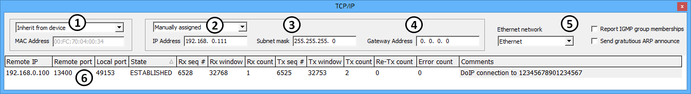

# TCP/IP

Vehicle Spy's **TCP/IP** view shows the current status of its TCP/IP connections for a selected ethernet network and allows editing of some parameters. A valid TCP/IP connection is required for [Diagnostics over IP (DoIP)](diagnostics-over-ip-doip.md). A maximum of 128 connections are allowed. TCP/IP view is opened from the [Spy Networks](./) menu.

Ethernet communication involves many protocols and TCP/IP view supports the following:

**Table 1: Ethernet Protocols Supported in VSpy's TCP/IP**

| Acronym | Name                                | Description                                                    |
| ------- | ----------------------------------- | -------------------------------------------------------------- |
| TCP     | Transmission Control Protocol       | Controls data flow between two nodes.                          |
| IP      | Internet Protocol                   | Controls addressing to ensure data gets to the correct node.   |
| UDP     | User Datagram Protocol              | Supports data flow from one node to all nodes.                 |
| IGMP    | Internet Group Management Protocol  | Supports data flow from one node to nodes in a specific group. |
| AutoIP  | Automatic Private IP Addressing     | Link-local IP address configuration per RFC 3927.              |
| DHCP    | Dynamic Host Configuration Protocol | Dynamic IP address distribution per RFC 2132.                  |
| ARP     | Address Resolution Protocol         | Maps virtual IP addresses to physical MAC addresses.           |

### TCP in Vehicle Spy

TCP has a virtual [network](networks/) in Vehicle Spy to expose data hidden within the raw ethernet traffic found on the physical networks like "Ethernet" and "OP (BR) ETH01". TCP also has a predefined [column set](messages-view/messages-view-column-headers.md) on [Messages](messages-view/) view to quickly organize the data from the virtual networks.

TCP requires the Tools > Options > [Spy Networks tab](../main-menu-tools/tools-options/options-spy-networks-tab/) setting "Use PC Ethernet interface" = ON.

### MAC Address

The **MAC Address** (Media Access Control) (Figure 1:) is a static address associated with a physical ethernet device. Vehicle Spy displays the address as a series of six bytes in hexadecimal format. The first three bytes of the MAC Address are 00:FC:70 for ICS hardware.

* Inherit from device - use the MAC address of ICS hardware that is [online](../../basic-operation-of-vehicle-spy/running-and-stopping.md) with VSpy.
* Manually assigned - use the MAC address entered.

### IP Address

The **IP Address** (Internet Protocol) (Figure 1:) is a dynamic address associated with a virtual node which is assigned as needed to route ethernet traffic correctly. Vehicle Spy displays the address as a series of four bytes in decimal format. A typical address to use is in the range from 192.168.000.000 to 192.168.255.255 which is reserved for private networks.

* Inherit from OS - use the IP address of the operating system VSpy is currently running in.
* Manually assigned - use the IP address entered.
* AutoIP + DHCP - use an IP address that configures itself after VSpy goes online with hardware.

The **Subnet mask** (Figure 1:) defines a network ID and host ID within the IP Address. The mask is logically AND'ed with the IP address to determine the IDs. Binary ones in the mask indicate the network ID and binary zeroes indicate the host ID. Vehicle Spy displays the mask as a series of four bytes in decimal format. A typical mask to use is 255.255.255.000.

The **Gateway Address** (Figure 1:) is the address of a router connected to other networks. This is where data will go if it has an unknown destination. Vehicle Spy displays the address as a series of four bytes in decimal format.

### Additional Settings

Additional settings are located on the right side of TCP/IP view. (Figure 1:)

**Ethernet network** determines which network the entire TCP/IP view is focused on.

If **Report IGMP group memberships** is enabled then Vehicle Spy will broadcast its group memberships after going online with hardware. IGMP supports data flow from one node to nodes in a specific group.

If **Send gratuitous ARP announce** is enabled then Vehicle Spy will announce its MAC and IP addresses after going online with hardware.

### TCP/IP Status Table

All of Vehicle Spy's TCP/IP connections for the selected network are indicated in the status table located in the lower area of TCP/IP view (Figure 1:).

**Table 2: TCP/IP Status Table**

| TCP/IP Column | Description                                                                                                                                                      |
| ------------- | ---------------------------------------------------------------------------------------------------------------------------------------------------------------- |
| Remote IP     | IP address that Vehicle Spy is trying to connect to.                                                                                                             |
| Remote port   | Port number that Vehicle Spy is trying to connect to.                                                                                                            |
| Local port    | Port number being used by Vehicle Spy.                                                                                                                           |
| State         | 
Current state of the TCP/IP connection.
<ul><li>Closed</li><li>Established</li><li>Listen</li><li>UDP - broadcast message sent to multiple nodes</li></ul> |
| Rx seq #      | Last sequence number received by Vehicle Spy.                                                                                                                    |
| Rx window     | Width (in bytes) of the sliding receive window.                                                                                                                  |
| Rx count      | The number of segments received by Vehicle Spy.                                                                                                                  |
| Tx seq #      | Last sequence number transmitted by Vehicle Spy.                                                                                                                 |
| Tx window     | Width (in bytes) of the sliding transmit window.                                                                                                                 |
| Tx count      | The number of segments transmitted by Vehicle Spy.                                                                                                               |
| Re-Tx count   | The number of segments retransmitted by Vehicle Spy.                                                                                                             |
| Error count   | The number of errors detected for the TCP/IP connection.                                                                                                         |
| Comments      | More details about the state of the TCP/IP connection                                                                                                            |
