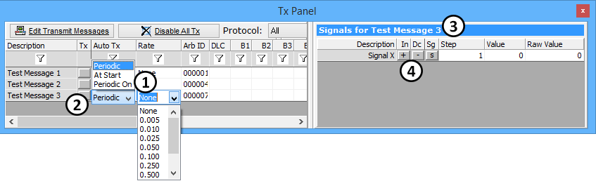
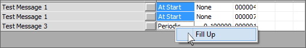

# Transmit Panel

The Tx Panel lists all transmit messages defined in Vehicle Spy. In fact, as you add transmit messages to the Message Editor, they are automatically added to the Tx Panel.

The Tx Panel is where manual or periodic message transmission is setup. Simply use the dropdowns to the right of the message description (Figure 1:) to make selections. A small gray button (Figure 1:) is included to manually send messages.

The right half of the Tx Panel (Figure 1:) displays signals associated with each transmit message as defined in the [Messages Editor](../message-editor/messages-editor-overview.md). Select or enter in the desired value for each signal (On/Off, True/False, Park, Reverse, Neutral, 1000, 5053, etc.) and Vehicle Spy will display the proper raw value. The **In** and **Dc** buttons (Figure 1:) will increment or decrement analog values by the set step size. This makes it quick and easy to change values. Send your message and watch Messages view closely. You will see the raw value encoded in the message's data bytes.

There is a Fill Up/Down feature on the right click menu while over the left side of the Tx Panel. This feature will fill all selected cells in a column with the same value as the first selected cell. To use the feature, select the cell to copy, then **Shift + left click** to highlight the range of cells to change, then right click and apply the **Fill Up/Down** feature as seen in **Figure 2**.

Please check the following video for more details.



