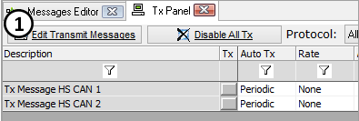

# Add and Delete Transmit Messages

Add or delete transmit messages in the Tx Panel by using the Transmit table of the [Messages Editor](../message-editor/messages-editor-overview.md). Use the **Edit Transmit Messages** button (Figure 1:) as a quick way to get there.

