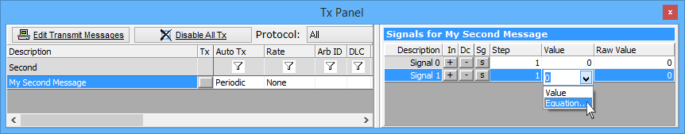

# Dynamic Transmit Message Bytes

It is possible to create messages in which data bytes are calculated before they are sent. This allows messages to include dynamic data - a crucial capability for simulation.

Vehicle Spy has the ability to dynamically create message data. Expressions can be assigned to signals in a transmit message. This signal association is done through the Tx Panel (Figure 1). Messages are displayed on the left side of the Tx Panel. Click on a message to select it and the signals associated with the message appear on the right.

Static signal values can be entered in the value cell for that signal. Custom equations and values can be entered in by using the **Equation** option in the drop down. When this option is selected a dialog for configuring the [Calculated Signal](../../../shared-features-in-vehicle-spy/shared-features-calculated-signal-editor/) appears.

Some predefined equations (random, sine, ramp, square) can also be quickly applied with the right mouse menu **Apply signal type** and selecting the desired waveform.

