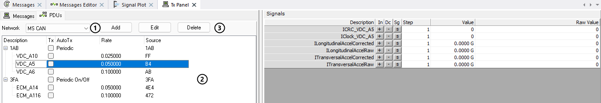
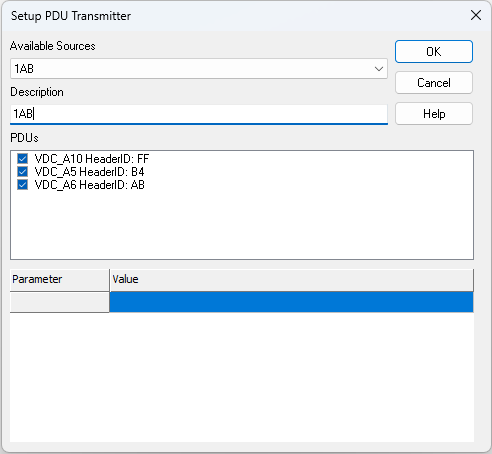

# PDU Transmitters

The **PDUs** tab of the Tx Panel transmits PDUs (Protocol Data Units) from the network database. A PDU transmitter builds one frame from the PDUs you choose. On CAN and Ethernet, each PDU is preceded by its PDU header (header ID and length). On FlexRay, each PDU is placed at its position in the frame. On a CAN network the frame is always sent as a CAN FD frame, padded to the next valid CAN FD length. On Ethernet it is sent as a UDP frame.

## The PDUs Tab

The **Network** dropdown (Figure 1:) lists the networks that have PDUs in the database. It selects the network whose sources the **Add** and **Edit** buttons offer. If no network has PDUs, the dropdown is empty and there is nothing to transmit on this tab.

The list (Figure 1:) shows all PDU transmitters, with the PDUs each one contains listed underneath.

**Tx** and **AutoTx** are set on the transmitter row; **Rate** is set on each PDU row. The columns are:

* **Description** - The transmitter's name, or the PDU's short name on the rows below it.
* **Tx** - Click the checkbox on a transmitter row to send all of its PDUs once; the box clears itself afterwards. When **AutoTx** is **Periodic On/Off**, the checkbox instead turns periodic transmission on and off, and it is unchecked each time the setup is loaded. Vehicle Spy starts running if it is not already online.
* **AutoTx** - How the transmitter sends while Vehicle Spy is running:
  * **Periodic** - Each PDU is sent at its **Rate**.
  * **At Start** - All PDUs are sent once when Vehicle Spy starts running.
  * **Periodic On/Off** - Same as **Periodic**, but only while the **Tx** checkbox is checked.
* **Rate** - The period of each PDU, in seconds. Pick a value or type one in. PDUs that are due at the same time are sent together in one frame. A PDU with a rate of **None** is only sent by the **Tx** button or by **At Start**.
* **Source** - The frame the PDUs are carried in: the arbitration ID (CAN), the source IP address and port (Ethernet), or the slot ID with the channel in the upper byte (FlexRay, for example 0x400012 is slot 0x12 on channel A). Each PDU row shows its header ID; on FlexRay this is the frame ID.

A new transmitter is set to **Periodic** with every **Rate** at **None**, so it sends nothing automatically until a rate is set. The **Disable All Tx** button on the Messages tab also stops PDU transmitters while Vehicle Spy is running. See [Auto Tx and Transmit Rate](ways-to-transmit-messages/auto-tx-and-transmit-rate.md) for how these settings work for transmit messages.

Select a PDU row to show its signals on the right side of the Tx Panel. Signal values are entered in the same way as for transmit messages; see [Dynamic Transmit Message Bytes](dynamic-transmit-message-bytes.md).

Use the **Add**, **Edit**, and **Delete** buttons (Figure 1:) to manage PDU transmitters. **Add** and **Edit** open the **Setup PDU Transmitter** dialog. When a PDU row is selected, **Edit** and **Delete** act on the transmitter it belongs to. Before clicking **Edit**, select the transmitter's network in the **Network** dropdown so its source is available.

## Setup PDU Transmitter Dialog

* **Available Sources** - Select the frame to transmit the PDUs in. The list contains every source the database defines PDUs for on the selected network.
* **Description** - The name shown in the PDUs tab. It defaults to the selected source; type a different name to keep it. A description is required.
* **PDUs** - Check the PDUs to include in the transmitter. Each entry shows the PDU name and its header ID. When adding a transmitter, every PDU for the source is checked by default. Right click the list for **Select All** and **Unselect All**. At least one PDU must be checked.
* **Ethernet frame properties** - For an Ethernet source, the grid shows the **Source MAC**, **Destination MAC**, **Source IP**, **Source Port**, **Destination IP**, **Destination Port**, and **VLAN** for the frame. The IP addresses, ports, and VLAN default from the database. The MAC addresses default to 00:FC:70:00:00:00 (source) and 00:FC:70:00:00:01 (destination). Click a value to change it, or double click **VLAN** to open the VLAN settings dialog. Vehicle Spy checks the addresses and ports when **OK** is clicked.

Click **OK** to save the transmitter. PDU transmitters are saved with the setup file.
