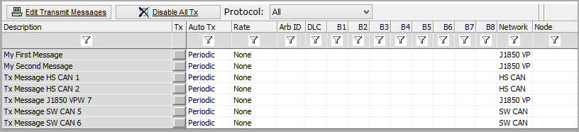
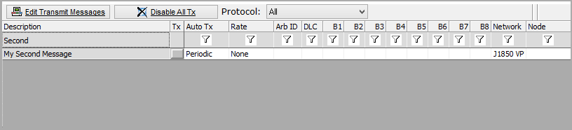

# Transmit Panel Filter Bar

Transmit messages can be quickly found by using the filter bar near the top of the Transmit Panel. In the example shown in **Figures 1 and 2**, entering in **Second** finds the **My Second Message** from the list of messages in the Transmit Panel. This same filtering technique works for the Network, Rate, and Auto Tx columns as indicated by the funnel icons.

