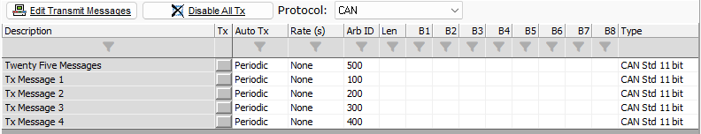
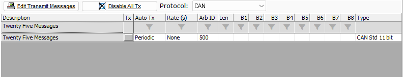

# Transmit Panel Filter Bar

Transmit messages can be quickly found by using the filter bar near the top of the Transmit Panel. In the example shown in **Figures 1 and 2**, entering **Twenty** finds **Twenty Five Messages** from the list of messages in the Transmit Panel. This same filtering technique works for every column that shows a funnel icon, including Auto Tx, Rate, Arb ID, Len, the data bytes, and Network.

