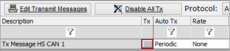

# Ways to Transmit Messages

One way to transmit a message is to click on the manual transmit button in the [Transmit Panel](../) as shown in **Figure 1**.

Vehicle Spy also supports many other ways to transmit messages as shown in Table 1.

| Ways to Transmit Messages                                                                                                                                     | Description                                                                                                                                                                                                                  |
| ------------------------------------------------------------------------------------------------------------------------------------------------------------- | ---------------------------------------------------------------------------------------------------------------------------------------------------------------------------------------------------------------------------- |
| [Periodic Message Transmission](auto-tx-and-transmit-rate.md)                                                                                                 | Transmits messages at an interval.                                                                                                                                                                                           |
| [Predefined Hotkey F4 Menu](../../../../shared-features-in-vehicle-spy/shared-features-predefined-function-keys.md)                                           | Tap keyboard F4 then corresponding number to transmit a message.                                                                                                                                                             |
| [Tx Button](../../../main-menu-measurement/graphical-panels/graphical-panels-tools/) on a [Graphical Panel](../../../main-menu-measurement/graphical-panels/) | A customizable button on a graphical panel which will transmit a message when pressed.                                                                                                                                       |
| [Automatic Response](../../message-editor/messages-editor-message-fields/receive-message-tx-msg-field.md)                                                     | Transmits a message when a message is received.                                                                                                                                                                              |
| Function Block: [Playback](../../../../vehicle-spy-tutorials/tutorial-1-basics-of-vehicle-spy/) Type                                                          | Replays a captured buffer of messages.                                                                                                                                                                                       |
| Function Block: Script Type                                                                                                                                   | Completely customizable script which can conditionally transmit messages.                                                                                                                                                    |
| [Messages Editor](../../message-editor/messages-editor-overview.md) Hotkey                                                                                    | Message is transmitted when the assigned keyboard hotkey is pressed.                                                                                                                                                         |
| [Widget](../../../../shared-features-in-vehicle-spy/shared-features-widgets.md)                                                                               | Customizable buttons along the window edges that will transmit messages when clicked. A Transmit Widget can be created by using the Widget setup or Transmit messages from the Tx Panel can be drag and dropped to a widget. |
