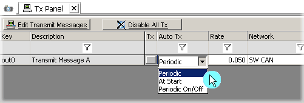

# Auto Tx and Transmit Rate

Transmit messages can be setup to be transmitted automatically. This is done in the Auto Tx column of the Tx Panel as shown in Figure 1. There are three automatic transmit modes to choose from.

* **Periodic** - Transmits the message at the rate setup in the Rate column.If the rate is zero (None) automatic transmit is disabled.
* **At Start** - The message is transmitted when Vehicle Spy is started.
* **Periodic On/Off** - Transmits the message at the rate setup in the Rate column if turned on. If the rate is zero (None) automatic transmit is disabled. The periodic transmit is turned on or off via the Graphical Panels or the manual transmit button.

The use of the Rate column is dependant upon the Auto Tx selection. Although the Tx Rate column has a drop down listing specific rates, you can also enter any rate desired by typing it directly into the field.

