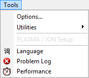

# Main Menu: Tools

The Vehicle Spy Tools main menu contains setup options, utilities, and hardware specific tools as shown in Figure 1. Refer to Table 1 for a brief description of each selection.

**Table 1: Vehicle Spy Tools Menu**

| Tools Menu Selection | Description                                                         |
| -------------------- | ------------------------------------------------------------------- |
| Options              | Displays software options for Vehicle Spy.                          |
| Utilities >          | Various file and hardware related utilities.                        |
|                      |                                                                     |
| PLASMA / ION Setup   | Displays VNC window to access Android on neoVI PLASMA and neoVI ION |
|                      |                                                                     |
| Language             | Opens dialog to select a language.                                  |
| Problem Log          | Displays Vehicle Spy software or hardware related problem logs.     |
| Performance          | Displays numerous Vehicle Spy performance statistics.               |
