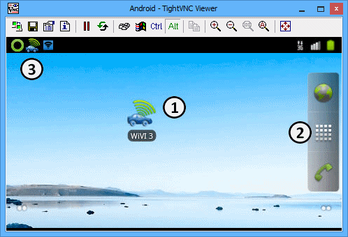
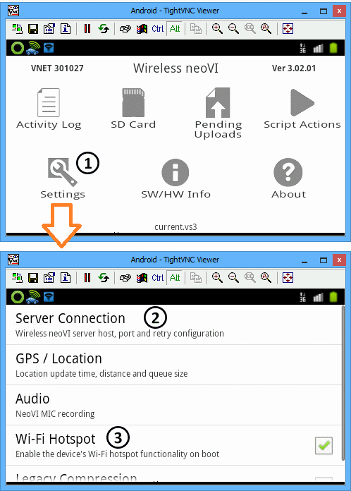
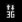

# PLASMA / ION Setup

The ICS loggers neoVI PLASMA and neoVI ION have an Android operating system running an application written by ICS called "WiVI 3" that has settings required for wireless operations.

The buttons and touch screen on neoVI PLASMA can open and change WiVI 3 settings directly, but neoVI ION does not have buttons or a screen; so what to do?

### Vehicle Spy's PLASMA / ION Setup

The answer for neoVI ION is to make WiVI 3 changes using Vehicle Spy's PLASMA / ION Setup opened from the [Tools](./) menu.This feature will also work for neoVI PLASMA, but it is recommended to use the PLASMA buttons and touch screen instead because they are simpler to use.

Use a PC to open the Android home screen on an ICS wireless logger by following these steps:

1. Connect the logger to DC power.
2. Connect the logger PC USB port to the PC.
3. On the PC, open Vehicle Spy, Tools > PLASMA / ION Setup then select the logger.

An Android TightVNC Viewer window should open showing the logger home screen similar to Figure 1.

The TightVNC Viewer window has peculiar navigation methods which are listed here for clarity:

**Table 1: TightVNC Viewer Commands**

| PC Input             | Android Command  | Result in TightVNC Viewer                           |
| -------------------- | ---------------- | --------------------------------------------------- |
| Left mouse button    | Select           | Selects item behind the mouse cursor.               |
| Right mouse button   | Back             | Returns to previous screen or menu.                 |
| Page Up key          | Menu             | Shows menu options, if available.                   |
| Up / Down arrow keys | Scroll Up / Down | Moves cursor up / down within a menu list of items. |
| Home key             | Home             | Returns to main home screen from anywhere.          |

### Changing Wireless Settings on an ICS Logger

Open WiVI 3 by left clicking on its icon in the TightVNC Viewer window. (Figure 1:) If the icon is not shown on the home screen, then click on the applications manager (white checkerboard to the right) (Figure 1:) and open WiVI 3 from there instead.

The WiVI 3 home screen (Figure 2) has various features not covered in this Vehicle Spy help documentation, but there are two **Settings** (Figure 2:) mentioned here that are critical to get an ICS wireless logger up and running.

**Server Connection Host & Port** (Figure 2:) settings must be correct for the logger to connect to a Wireless neoVI server and website. Contact the local Wireless neoVI administrator or Intrepid Control Systems to get the correct values.

**Wi-Fi Hotspot** (Figure 2:) must be enabled if using Vehicle Spy for Android on a tablet as an added display device.

### Status Bar Icons

Near the top of the TightVNC Viewer screen (Figure 1:) are icons to indicate new or ongoing events. Table 1 lists many of the icons and what they mean.

**Table 1: ICS Logger Status Bar Icons**

|                                       Icon                                       | Description                                                               |
| :------------------------------------------------------------------------------: | ------------------------------------------------------------------------- |
|  | 3G network - alternating arrows means data is transferring.               |
|                                  | Battery status full. (VNET connected to DC power)                         |
|                                    | GPS enabled and locked in.                                                |
|                                  | GPS enabled, but not locked in. (blinking circle means trying to lock in) |
|                       | Cellular signal - full strength.                                          |
|                    | Cellular signal - some strength.                                          |
|                       | Cellular signal - no signal.                                              |
|                               | SIM card not detected.                                                    |
|                                   | Sound is muted.                                                           |
|                                      | Tethering or hotspot is active.                                           |
|                            | TightVNC is connected.                                                    |
|                        | WIFI signal - full strength.                                              |
|                       | WIFI signal - some strength.                                              |
|                        | WIFI signal - no signal.                                                  |
|                                        | WirelessNeoVI service is enabled and server is online.                    |
|                                | WirelessNeoVI service is disabled or server is offline.                   |
