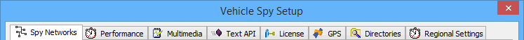

# Tools: Options

Many important Vehicle Spy settings are located in the Vehicle Spy Setup dialog shown in Figure 1. Access this dialog by clicking on Tools and then Options.

Use the Vehicle Spy setup dialog to setup the following:

* [Spy Networks](options-spy-networks-tab/) (includes [J1850 VPW Mode](options-spy-networks-tab/spy-networks-tab-j1850-vpw-mode.md))
* [Performance](options-performance-settings.md)
* [Multimedia](options-multimedia/)
* [Text API](options-text-api-options.md)
* [License](options-license-system/)
* [GPS](options-gps-setup.md)
* [Directories](options-data-directories.md)
* [Regional Settings](options-regional-settings.md)

## Copy To Clipboard (Figure 1:)

This button will take a screenshot (as an image) of the currently displayed options panel. This is useful if you want to share your options with another user or if you are asked to send your options to support. After you click "Copy to Clipboard", you can paste the image into an email or online chat.
