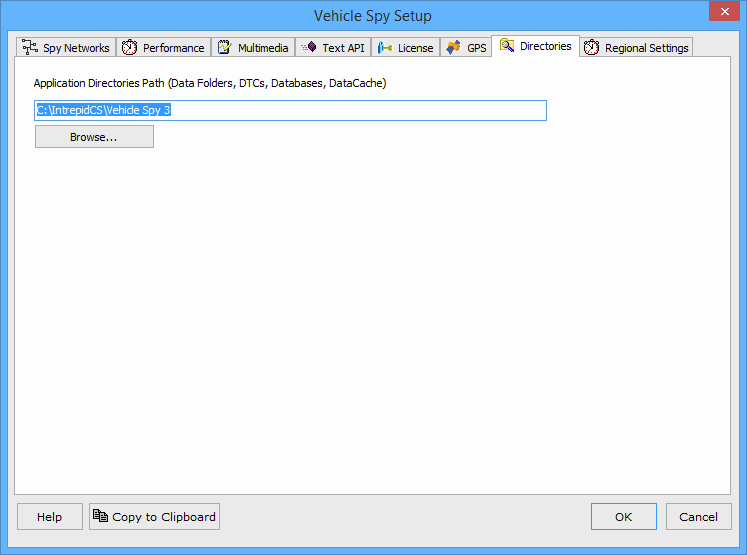

# Options: Data Directories

The default directory Vehicle Spy installs to is "**C:\IntrepidCS\Vehicle Spy 3\\**". In some cases you may want to move this folder. The Directories tab of Vehicle Spy 3 setup will let you change this location. Click on browse and select the new directory.

