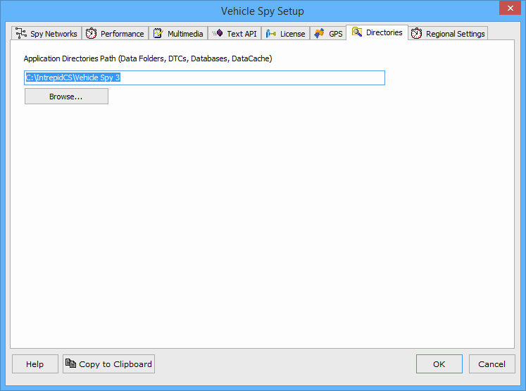

---
metaLinks:
  alternates:
    - >-
      https://app.gitbook.com/s/L6lcovCpkhoS9uTOFtEp/vehicle-spy-main-menus/main-menu-tools/tools-options/options-data-directories
---

# Options: Data Directories

The default directory Vehicle Spy installs to is "**C:\IntrepidCS\Vehicle Spy 3\\**". In some cases you may want to move this folder. The Directories tab of Vehicle Spy 3 setup will let you change this location. Click on browse and select the new directory.

