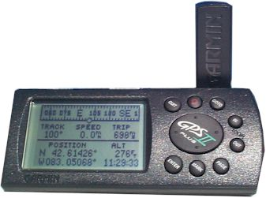
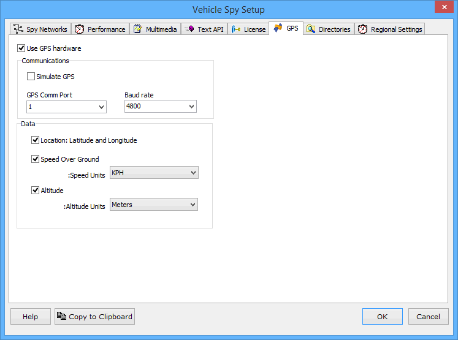

# Options: GPS Setup

Vehicle Spy can acquire data from a GPS (Global Positioning System) receiver (Figure 1). This is setup in the Vehicle Spy Setup dialog. Open Vehicle Setup by clicking Tools-> [Options](./).

On the GPS tab, you can select whether or not you want to use the receiver. If you select to use GPS hardware, you must select a communication port.

Whatever data you select will appear in [Messages view](../../main-menu-spy-networks/messages-view/) once per second. You can select Location, Speed Over Ground, and/or Altitude. This selection is for the Messages view only. All the data is always available from the value source column for incoming messages (described below).

The data received by the GPS unit is available in the [Expression Builder](../../../shared-features-in-vehicle-spy/shared-features-expression-builder.md) under "[Misc](../../../shared-features-in-vehicle-spy/shared-features-expression-builder.md#misc-data-items)". GPS Altitude, Latitude, Longitude, Speed, and Valid are selectable parameters.

The latitude and longitude are always reported in degrees.

Vehicle Spy supports most GPS receivers with a NMEA-0183 output accessible over a Comm port interface.
