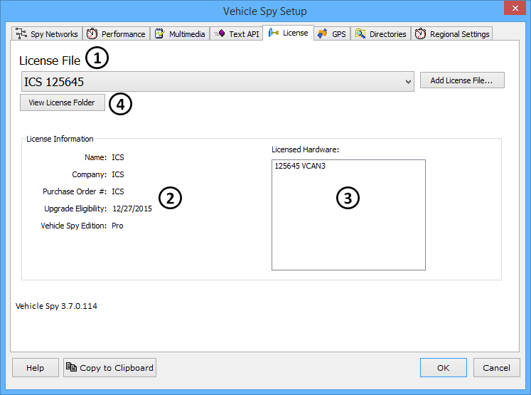

# Options: License System

Vehicle Spy uses a hardware/software licensing system. Your licensing information is setup in the License tab on the Vehicle Spy Setup dialog (Figure 1). This dialog is opened by selecting Tools->[Options](../) from the Vehicle Spy main menu.

### Obtaining Your License File

When you purchase Vehicle Spy, you will receive a license file from [Intrepid Control Systems](https://intrepidcs.com/contact-us/). A license file (.tablic) will either be included on the CD that ships with your purchase or emailed directly to you (earlier, it was \*.LIC). If you do not receive a License file or have lost it, please [contact](https://intrepidcs.com/contact-us/) Intrepid Control Systems for information on obtaining another copy.

### Setting Up or Changing the License File

In the Tools->Options->Vehicle Spy Setup->License tab, the box labeled "License File" displays the name of the current license (Figure 1:). To load your first license file or switch to another license file, click the "Add License File" button. A window will open allowing you to select the license wherever you have stored it on your computer. Once a license file is selected, license information will appear at the bottom of the setup screen (Figure 1:). This information includes Name, Company, Purchase Order Number and Upgrade Eligibility. The Licensed Hardware field (Figure 1:) shows the serial numbers of the hardware units that are compatible with this license file. The serial number of your hardware can be found on the sticker on the device.

If license files need to be moved or copied, clicking on the "View License Folder" (Figure 1:) will open the license folder with Windows Explorer.

Included with the license you purchased is a period of free upgrades. If you have a permanent license (not a temporary or evaluation version) your expiration of your free upgrade period is shown in the "Upgrade Eligibility" field (Figure 1:).

\*If you try to install a version of Vehicle Spy that was released after the expiration of your free upgrade period, the license system will not allow the software to function.

Please [contact](https://intrepidcs.com/contact-us/) Intrepid Control Systems for information on how to upgrade your license and receive additional free upgrade time.

### Transferring Your License to Another PC

To transfer a Vehicle Spy license to another computer, simply copy the \*tablic file (earlier, it was \*.LIC) to the new computer and set up the License tab as described above. Vehicle Spy will be unlocked if a licensed hardware unit is connected.

