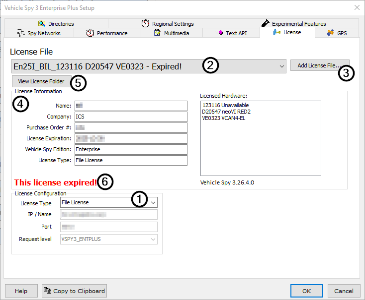
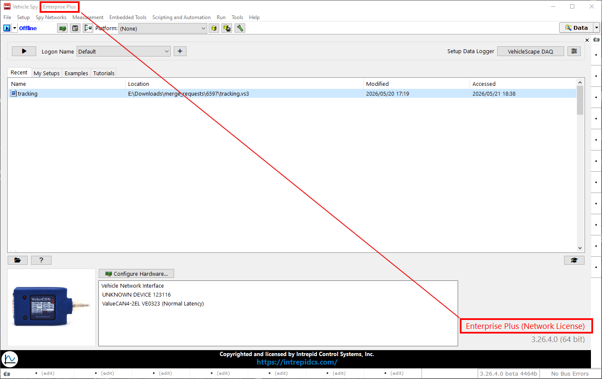
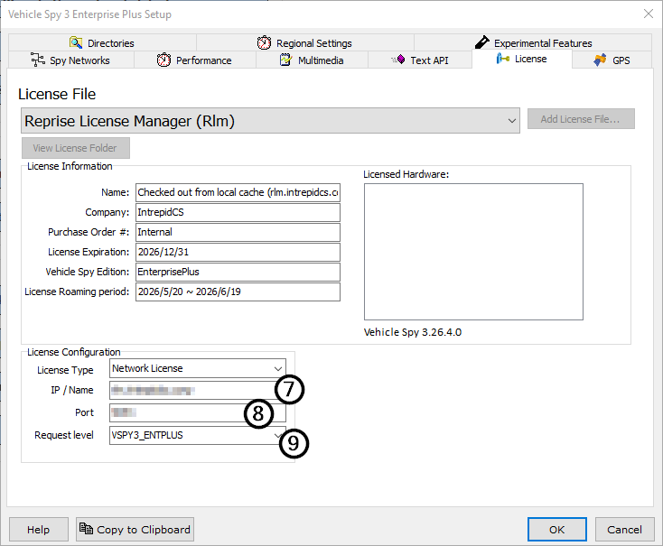
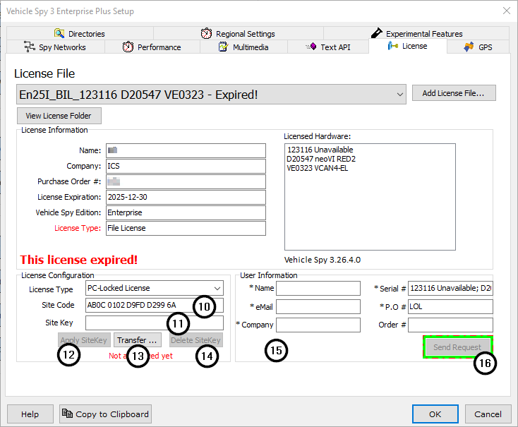

# Options: License System

Vehicle Spy uses a hardware/software licensing system. Licensing is configured on the **License** tab found at Tools → [Options](../) in the Vehicle Spy main menu.

### License Types

Vehicle Spy supports three license types. The active type is selected in the **License Configuration**  group at the bottom of the tab.

| Type | Description |
|---|---|
| **File License** | A `.tablic` file tied to one or more hardware serial numbers. The most common license type for purchased copies of Vehicle Spy. |
| **Network License** | A floating license checked out from a Reprise License Manager (RLM) server. Used in multi-seat enterprise environments. |
| **PC-Locked License** | A time-limited standalone demo license granting full use of Vehicle Spy for a specified period.

### How do I know which license is active?

Vehicle Spy displays the active license type in the title bar as well as in the lower right margin of the [Logon View](../../../../basic-operation-of-vehicle-spy/the-logon-screen.md):

### Obtaining Your License File

For a `File License`, you will receive a `.tablic` file from [Intrepid Control Systems](https://intrepidcs.com/contact-us/) when you purchase Vehicle Spy. It will be emailed directly to you or included with your purchase. If you have not received a license file or have lost it, please [contact](https://intrepidcs.com/contact-us/) Intrepid Control Systems for a replacement.

For a `Network License`, contact your RLM server administrator. For a `PC-locked license`, contact [Intrepid Control Systems](https://intrepidcs.com/contact-us/).

### Selecting a License File

The **License Files**  dropdown at the top of the tab shows the currently active hardware-based license. To add a new license file, click **Add License File...**  and browse to the `.tablic` file on your computer. Once selected, the **License Information**  group (described below) will populate with the details stored in that file.

To open the folder where license files are stored, click **View License Folder** . This opens the folder in Windows Explorer, where you can add, remove, or copy license files directly.

### License Information

After a license is loaded, the **License Information**  group displays the following read-only fields:

| Field | Description |
|---|---|
| **Name** | The licensee name associated with the license. |
| **Company** | The company name associated with the license. |
| **Purchase Order #** | The purchase order number for the license. |
| **Upgrade Eligibility** | The date through which free software upgrades are included. See [License Upgrade Eligibility](license-upgrade-eligibility.md) for details. |
| **Vehicle Spy Edition** | The edition of Vehicle Spy covered by this license (e.g., Professional). |
| **License Type** | Indicates whether this is a full, demo, or evaluation license. |
| **Licensed Hardware** | A list of hardware serial numbers that are authorized by this license file. The serial number of your device can be found on the sticker on the unit. |

A status message at the bottom of the group will appear in red if the license has expired.

### License Configuration

The **License Configuration**  group controls how Vehicle Spy acquires its license. Use the **License Type**  dropdown to select one of the three modes described below.

#### File License

This is the default license type for purchased copies of Vehicle Spy. A `.tablic` file received from Intrepid Control Systems is stored locally on your machine and tied to specific hardware serial numbers. Vehicle Spy is unlocked when a device whose serial number is listed in the license file is connected.

When a hardware-based license expires, you can continue to use the version of Vehicle Spy that was installed while the license was valid. However, you will not be able to run newer versions of Vehicle Spy released after the expiration date without first renewing your license. See [License Upgrade Eligibility](license-upgrade-eligibility.md) for details.

To use a hardware-based license on a different computer, copy the `.tablic` file to the new machine and add it using **Add License File...** 

No additional configuration fields are required for this mode.

#### Network License

This mode supports multi-seat deployments using [Reprise License Manager (RLM)](https://www.reprisesoftware.com/). Your RLM administrator installs a Vehicle Spy license on the RLM server, which enables a configured number of concurrent seats.

When Vehicle Spy starts, it checks out a seat from the server and holds it for a configured linger period. During the linger period, Vehicle Spy can be used fully offline — network access is only required to perform the initial checkout or to renew a seat after the linger period expires. When the linger period ends, the seat is automatically returned to the server and made available to other users. Vehicle Spy will attempt to check out a new seat automatically when network access is restored.

When Network mode is selected, the following fields appear:

| Field | Description |
|---|---|
| **IP / Name**  | The hostname or IP address of the RLM license server. |
| **Port**  | The network port the RLM server is listening on. |
| **Request Level**  | The license feature level to request from the server. |

#### PC-Locked License

This mode provides a time-limited standalone demo license that grants full use of Vehicle Spy for a specified period. It does not require connected hardware. After the demo period expires, Vehicle Spy will no longer run until a new license is applied.

To activate a PC-Locked demo license:
1. Select **PC-Locked License** as the License Type. The read-only **Site Code** field will populate with a code unique to this installation.
2. Provide the Site Code to [Intrepid Control Systems](https://intrepidcs.com/contact-us/) to receive a Site Key.
3. Enter the Site Key in the **Site Key** field and click **Apply SiteKey**.

The following options are available in this mode:

| Control | Description |
|---|---|
| **Site Code** | A read-only code unique to this installation. Provide this to Intrepid Control Systems when requesting activation. |
| **Site Key** | Enter the activation key provided by Intrepid Control Systems. |
| **Apply SiteKey** | Applies the entered Site Key to activate the demo license. |
| **Transfer...** | Transfers this PC-Locked license to another machine. See below. |
| **Delete SiteKey** | Removes the current Site Key activation from this machine. |

### Transferring a PC-Locked License

A PC-Locked license is tied to the machine it was activated on. To move it to a different computer, click **Transfer...** in the PC-Locked / Demo configuration panel. This will deactivate the license on the current machine and generate a transfer code that can be used to activate it on the new machine.

> **Note:** Simply copying files to another machine is not sufficient to transfer a PC-Locked license. Use the **Transfer...** button to properly move the activation.
