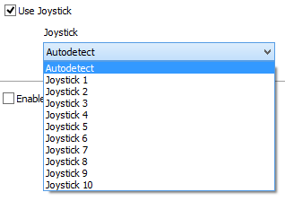

# Multimedia: Joystick Setup

A joystick can be used to trigger events, send messages, simulate analog or digital IO, and trigger data captures.

Joysticks are enabled on the Tools->[Options](../)->[Multimedia](./) tab. To enable a joystick, first check the "Use Joystick" checkbox as shown in Figure 1. Next, use the Joystick pulldown field to select Autodetect if you have only one joystick connected. If multiple joysticks are connected, use the pulldown field to select which joystick will have input into Vehicle Spy.

Vehicle Spy supports up to three analog axes and ten buttons. Any extra joystick axes or buttons are ignored. Reported joystick values can be accessed in the [Expression Builder](../../../../shared-features-in-vehicle-spy/shared-features-expression-builder.md) as Misc data items and can be applied to almost any expression.

