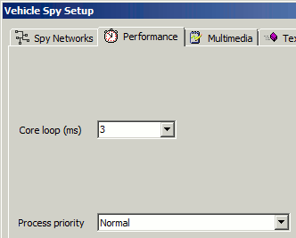

# Options: Performance Settings

The Tools -> Options -> Performance tab has settings that tell a computer how fast to run Vehicle Spy. The defaults are 3 milliseconds for Core Loop time and a normal Process Priority. Lower loop times and higher process priorities will make Vehicle Spy try to run faster. Making Vehicle Spy run faster can adversely affect the performance of other programs running on the computer depending upon the program and the power of the computer.

