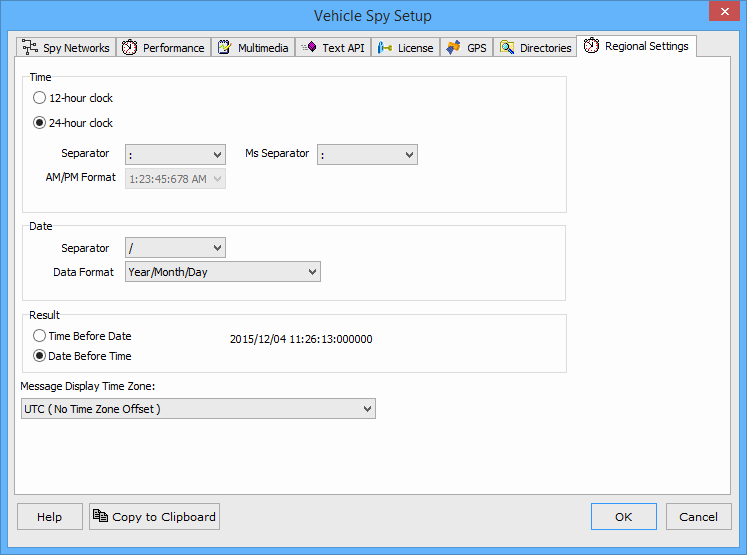

# Options: Regional Settings

The Tools -> Options -> Regional Settings tab controls the format of the Messages view column called "RTC Time". The RTC Time is a Real Time Clock stamp put onto each message, assuming the connected hardware supports an RTC.

Changes to these settings also affect those found on the Advanced Extractor Options, Regional Settings tab.

