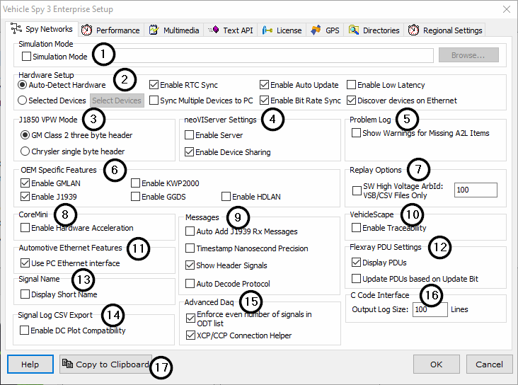

# Options: Spy Networks Tab

Vehicle Spy interacts with a vehicle network through [Vehicle Network Hardware](../../../../vehicle-network-interface-hardware/) available from ICS. The ability to setup various hardware settings can be found using the "Spy Networks" tab in the Vehicle Spy Setup dialog (Figure 1), found under the [Tools](../../) -> [Options](../) menu.

### Simulation Mode (Figure 1:)

Vehicle Spy allows simulation of hardware by reading a data file and playing it back into Vehicle Spy as if it was coming directly from the hardware. This is useful for training or setting up VS3 files when it would not be possible to utilize the specific hardware or a network.\
\
To enable hardware simulation, first enable the "Simulation Mode" checkbox and select a data file using the "Browse" button. Now going online with the main Vehicle Spy blue play/stop button will immediately begin simulating the data that was selected. If the simulation files are needed to be changed quickly, use the [Run Simulation](../../../../basic-operation-of-vehicle-spy/running-and-stopping.md) selection in the pull down list next to the blue play/stop button.\
\
[Sample data files](../../../../application-notes/sample-replay-files.md) are included in the Vehicle Spy 3 directory. The file "All Bus Traffic.csv" is used in the Vehicle Spy [tutorials](../../../../vehicle-spy-tutorials/) to simulate traffic.

### Hardware Setup (Figure 1:)

If vehicle network hardware is available then use this area to help configure it. If Auto-Detect is not enabled, the hardware connection needs to be specified.

* **Auto-Detect Hardware** - automatically uses the first supported connected device on the system.
* **Multiple Devices** - supports multiple devices that must be manually specified.
* **Enable RTC Sync** - sets the Real Time Clock inside supported hardware to match the PC time.
* **Sync Multiple Devices to PC** - syncs time from the computer
* **Enable Auto Update** - ensures the current firmware in Vehicle Spy is also in the hardware.
* **Enable Bit Rate Sync** - checks for baud rate conflicts between hardware and [Network](../../../main-menu-spy-networks/networks/setup-a-network.md) settings.
* **Enable Low Latency** - option to try and read USB data quicker. This option should be disabled in most cases.
* **Discover devices on Ethernet** - discover devices on the PC via ethernet.

### J1850 VPW Mode (Figure 1:)

This option determines how [J1850 VPW header bytes](spy-networks-tab-j1850-vpw-mode.md) will be treated.

### neoVIServer Settings (Figure 1:)

* **Enable Server** - allows neoVI hardware to be used by multiple applications at the same time.
* **Enable Device Sharing** - controls how Vehicle Spy connects to shared neoVI hardware when BOTH neoVIServer and Autodetect Hardware are enabled. If Device Sharing is enabled then Vehicle Spy connects to the last hardware used or the first one it autodetects, regardless if that hardware is opened by other applications. If Device Sharing is disabled then Vehicle Spy skips over hardware currently opened by other applications.

### Problem Log (Figure 1:)

* **Show Warnings from Missing A2L Items** - when enabled, suppressed warnings will be displayed in the [Problem Log](../../tools-problem-log.md). If this is disabled minor warnings will not be displayed.

### OEM Specific Features (Figure 1:)

This area enables helpful features specific to Original Equipment Manufacturers and their suppliers. These settings can directly affect how other areas in Vehicle Spy will appear and operate.

* **GMLAN** - GMLAN protocol for General Motors.
* **KWP2000** - Keyword 2000 protocol for Chrysler.
* **J1939** - SAE J1939 protocol for John Deere.
* **GGDS** - ISO 14229 protocol for Ford.
* **HDLAN** - ISO 14229 protocol for Harley Davidson.

### Replay Options (Figure 1:)

* **SW High-Voltage ArbId** - By enabling this option, playback of VSB or CSV files in a playback function block will generate a message with the provided ArbId to attempt to wake up the high-voltage provider in the vehicle.

### CoreMini (Figure 1:)

* **Enable [Hardware Acceleration](../../tools-utilities/utilities-hardware-acceleration.md)** - to use [CoreMini](../../utilities-coremini-console/) to periodically transmit messages as efficiently as possible.

### Messages (Figure 1:)

* **Auto Add J1939 RX messages** - Automatically add J1939 messages to the receive table
* **Timestamp Nanosecond Precision** - Allows nanosecond precision to be applied to messages
* **Show Header Signals** - Allows display of "signals" in from the message's header.  (protocol-specific)
* **Auto Decode Protocol** - When enabled, will decode diagnostic messages in the messages view.

### VehicleScape (Figure 1:)

* **Enable Traceability** - Enables hidden fields in VSSAL > Generation Options for Author + Project + Vehicle.  This feature is intended to help determine who made changes to logging setups.

### Automotive Ethernet Features (Figure 1:)

* **Use the PC Ethernet Interface** - Enables the use of the PC ethernet adapter as a data collection source.  Changing this setting requires restart of Vehicle Spy.

### FlexRay PDU Settings (Figure 1:)

* **Display PDUs** - Enabled by default, this option enables display of contained PDUs in FlexRay frames.
* **Update PDUs based on Update Bit** - Some OEMs utilize an update bit to indicate when a PDU is updated.  If this option is enabled, PDUs will be updated based on the status of this update bat.

### Signal Name (Figure 1:)

* **Display Short Name** - Switch from displaying the signal's "long name" to the signa's "short name" as defined in a database file.

### Signal Log CSV Export (Figure 1:)

* **Enable DC Plot Compatibility** - Makes VSpy CSV export compatible with Chrysler "DC Plot".

### Advanced Daq (Figure 1:)

* **Enforce even number of signals in ODT list** - Enabling this option will warn the user if the number of signals selected isn't an even number.  This option was to handle a OEM/supplier ECU data acquisition quirk and is likely not necessary.  Disabled by default.
* **XCP/CCP Connection helper** - Displays a new tab in the MEP options called "Connection Helper" that allows fine-tuning of XCP and CCP connect and disconnect options to work around various OEM/supplier ECU quirks.

### C Code Interface (Figure 1:)

* **Output Log Size** - Manually set the default output log size for the C Code interface.

### Copy To Clipboard Button (Figure 1:)

This button will take a screenshot (as an image) of the currently displayed options panel.  This is useful if you want to share your options with another user or if you are asked to send your options to support.  After you click "Copy to Clipboard", you can paste the image into an email or online chat.

