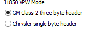

# Spy Networks Tab: J1850 VPW Mode

The [Tools](../../) -> [Options](../), [Spy Networks](./) tab lets you select how the J1850 VPW headers are handled as shown in Figure 1.

Option 1: Select the default GM Class 2 version with a three byte header (PT, Trgt, Src).

Option 2: Select Chrysler version with a one byte header (ID).

The J1850 VPW Mode setting affects many areas of Vehicle Spy, including [Messages](../../../main-menu-spy-networks/messages-view/messages-view-column-headers.md) view and the [Messages Editor](../../../main-menu-spy-networks/message-editor/messages-editor-message-fields/). When decoding signals, for example, a reference to the first data byte (B1) of a J1850 message actually means a reference to byte 2 in Chrysler mode or to byte 4 in Class 2 mode.

