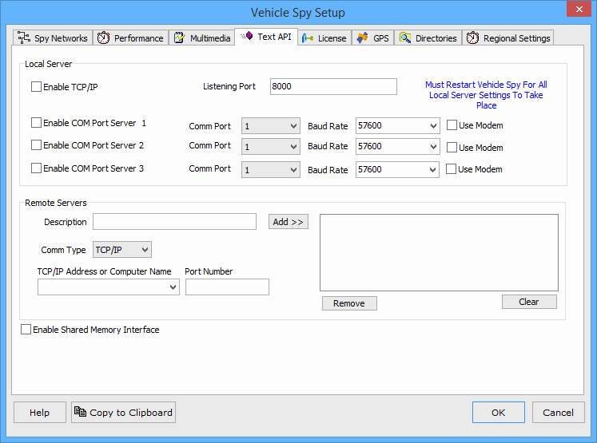

# Options: Text API Options

The Tools -> Options -> Text API tab (Figure 1) configures different ports to "talk to" Vehicle Spy. Text API is a method of sending text strings to Vehicle Spy to request or send information.

If you wish to make a TCP/IP connection, check the "Enable TCP/IP" check box and specify the proper port is set in the "Listening Port" field on the right. Note: Vehicle Spy must be restarted before setting changes take place.

Com Port servers are setup in the fields just below the Local Server TCP/IP fields.

The Remote Servers section specifies the computer with which to connect. The Description field is where you can enter a friendly name for the computer. In the box below, Comm Type can be set to either TCP/IP or RS-232. If TCP/IP or Computer Name, enter the address of the computer. The Port Number entry tells Vehicle Spy which port to connect on. When RS-232 is being set choose the Comm Port and Baud Rate. Once all the settings are filled in for the Remote Server, click "Add". Your settings will be listed in the area on the lower right. To remove a single setting from this area, simply select it and press "Remove". To clear all settings listed, press "Clear".

