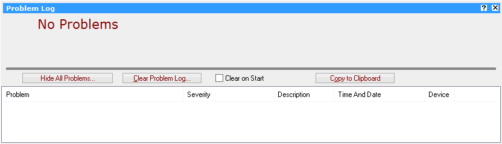
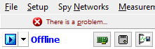

# Tools: Problem Log

The Problem Log (Figure 1) shows any Vehicle Spy related problems or warnings that may require the user's attention. This screen will automatically open if Vehicle Spy detects any critical problems. For less critical problems, Vehicle Spy will display an indication in the upper left corner (Figure 2). Clicking this warning will display the problem log. The problem log can be manually opened from [Tools](./) -> Problem Log.

The **Show/Hide All Problems** button toggles the problem log table area on and off. Clicking the **Clear Problem Log** button clears the log and closes the screen. The Problem Log will automatically clear itself each time Vehicle Spy starts if the **Clear on Start** checkbox is enabled.

When dealing with support issues, the **Copy to Clipboard** button copies all listed problems to the clipboard. This information can be pasted into an email or text file.

