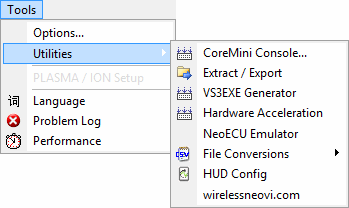

# Tools: Utilities

The Vehicle Spy Tools -> Utilities menu has logger and file related tools as shown in Figure 1.  Refer to Table 1 for a brief description of each selection.

**Table 1: Vehicle Spy Utilities Menu**

| Utilities Menu Selection | Description                                                                    |
| ------------------------ | ------------------------------------------------------------------------------ |
| CoreMini Console         | Opens a configuration tool for loading CoreMini files to compatible hardware.  |
| Extract / Export         | Extracts logger files and exports message and signal data.                     |
| VS3EXE Generator         | Converts a Vehicle Spy setup (vs3) into a "display only" setup (vs3exe).       |
| Hardware Acceleration    | Allows certain types of function block scripts to run more quickly than usual. |
| neoECU Emulator          | Opens a basic emulation tool of the neoECU hardware.                           |
| File Conversions >       | Various file conversion utilities.                                             |
| HUD Config               | Opens a tool to guide you through the setup of an Android heads up display.    |
| wirelessneovi.com        | Opens the Wireless neoVI interface.                                            |
