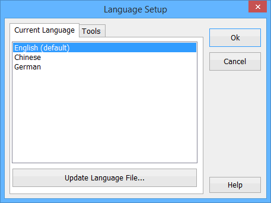

# Tools: Language

Vehicle Spy has support for multiple languages. To change the language Vehicle Spy uses, click on Tools->Language. The Language Setup window will appear (Figure 1). Select the desired language and press OK.

If the language you prefer is not in the list, it can be easily created. In the Vehicle Spy 3 directory there is a directory called "Languages". The language files are text files that contain English on the left side and then the other language on the right. An easy way to create a language file is to alter an existing one. Below is an example from a Spanish conversion. The "&" represent the underline for Alt character for hot keys.

Example: E\&xit will appear as Exit and will be clicked when Alt+E is pressed on the keyboard.

E\&xit=Salida\
\&Open...=Abierta\
\&File=Archivo\
\&Logon=Conexion\
\&New=Nuevo\
\&Save=Excepto\
Save \&As=Excepto Como\
\&Explore Data Directory=Explore El Directorio De Datos\
\&Review Buffer=Almacenador intermediario De la Revision

