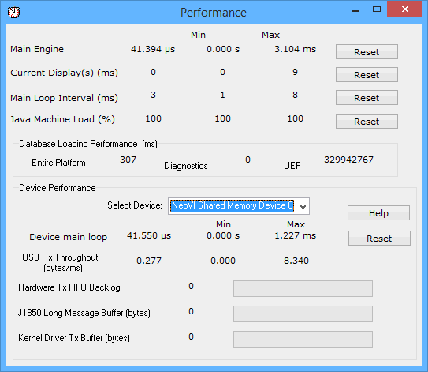

# Tools: Performance

The Tools -> Performance selection displays many Vehicle Spy application related statistics as shown in Figure 1. If necessary, the core loop time and process priority can be adjusted to accommodate different computer speeds.

