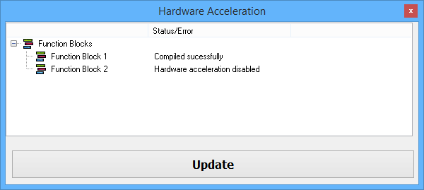

# Utilities: Hardware Acceleration

If you only need to periodically transmit messages as efficiently as possible then Hardware Acceleration can help by improving periodic transmit message timing accuracy and removing the need to use the CoreMini Console.\
\
The ICS hardware is accelerated by automatically running specific\* periodic transmit function block scripts internally as CoreMini. This is more efficient than running those same scripts externally with Vehicle Spy through a USB connection.\
\
The Hardware Acceleration dialog in Figure 1 (found under Tools -> Utilities) shows which function blocks have Hardware Acceleration enabled. The **Update** button just refreshes the dialog display, it does NOT update the CoreMini logic in the ICS hardware.\
\
ALL of these conditions must be met to make Hardware Acceleration work:

* Tools/Options/Spy Networks tab has Hardware Acceleration enabled.
* \*Each function block script can only have Wait, Jump, and Transmit steps.
* Each function block script Start tab has Hardware Acceleration enabled.
* CoreMini capable ICS hardware is powered and connected to the PC.
* Vehicle Spy is taken online in transmit mode with the ICS hardware.

If ALL of the above conditions are met then the scripts are automatically run as CoreMini without needing to use the CoreMini Console. The hardware will show this with a flashing red LED indicating that CoreMini is running.

