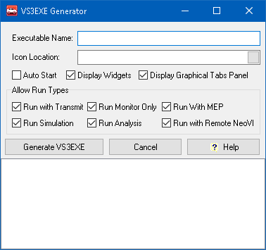

# Utilities: VS3EXE Generator

The Embedded Tools -> VS3EXE Generator (Figure 1) converts a Vehicle Spy vs3 setup into a simplified version with "read only" displays. This utility can help make your setup easier for others to use and reduce mistakes by preventing them from changing your setup. The simplified file will have a vs3exe extension that requires a special license from ICS to run.

A vs3exe file from the generator supports these Vehicle Spy views:

* Messages
* Signal Plot
* Signal List
* Graphical Panels (locked mode)

You can also restrict how Vehicle Spy goes online under the **Allow Run Types** section.

To use the generator, you first open any vs3 file in Vehicle Spy that you want converted. Next, select Embedded Tools-> Utilities -> VS3EXE Generator. Give the file a name, and, optionally, select an Icon for the generated VS3EXE. Set the various display and Run options, then click the **Generate VS3EXE** button. The vs3exe file extension is added automatically and you are done!

Other users with the proper license can run the vs3exe file, but will not be able to make changes to message descriptions, databases, graphical panel layouts, etc.

