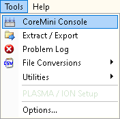
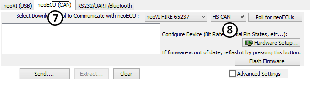
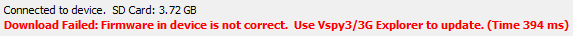

# Utilities: CoreMini Console

The CoreMini Console is a tool for loading CoreMini Scripts into supported hardware. Some applications for CoreMini Scripts could be ECU simulation, Data Logging, Hardware acceleration, and Gateways all ran without a PC.\
\
CoreMini Scripts start as Vehicle Spy 3 files. The CoreMini Console converts and loads the file into the supported hardware. The CoreMini Console is found under Tools -> Utilities -> CoreMini Console (figure 1)

The CoreMini Console itself is shown in figure 2. When this dialog opens, it compiles the Vehicle Spy file. The notes section (Figure 2: ) reports any errors or warnings when trying to compile the file. Errors and warnings will be noted by a Red dot. Items compiled successfully will have a green dot. The "Send To USB Device" section holds the settings for selecting a neoVI **FIRE**, neoVI RED, ValueCAN 3, or other supported CoreMini Hardware.\
\
The Device drop down (Figure 2: ) lets you chose the hardware to use while the Storage drop down selects where in the hardware to store the script. The "Run CoreMini After Download" check box (Figure 2: ) gives the option of running the script once it is downloaded to the hardware. If this is unchecked, the hardware has to be re-powered to run the script. The "Send..." button (Figure 2: ) will send the script to the selected destination.\
\
If the "Run CoreMini After Download" box is checked, the script will start to run. To remove a script from the selected hardware, the "Clear" button (Figure 2: ) is used. The Advanced settings checkbox (Figure 2: ) reveals a few extra options. The first is to "Skip Read Bin". This option is useful when working with large files, for example replay files. Enabling this option will prevent reloading the file if the hardware already has it loaded. This options is defaulted off. The second option is to "Enable RTC Sync", which controls updating the RTC in the hardware when a CoreMini is loaded into the device. The default for this option is enabled.

Some hardware devices support loading CoreMini Scripts over CAN, neoVI ECU would be an example. CoreMini scripts are sent to these types of devices using the "neoECU (CAN)" (Figure 3: ) option. The supported networks are listed in the "Network" drop down (Figure 3: )is sent to the device using the "Send..." button.

**IMPORTANT:** It is very important that the firmware in CoreMini capable device match what the software expects. If you try to load a CoreMini to a device with incorrect firmware a warning should be displayed at the bottom (Figure 4). This can be fixed by connecting to neoVI 3G Explorer or in Vehicle Spy 3 if "Enable Auto updates" is turned on under [Tools -> Options](../tools-options/options-spy-networks-tab/). You can also use the Manual Reflash button in neoVI 3G Explorer. It is recommended to leave Enable Auto Update enabled.

