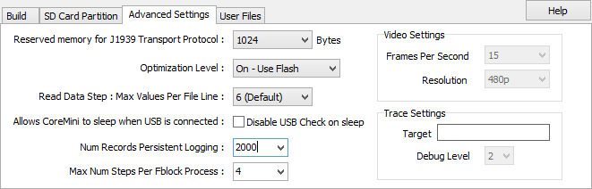

# Utilities: CoreMini Advanced Settings

The Advanced Settings tab holds extra settings to configure CoreMini logging.

The "Reserved memory for J1939 Transport Protocol" option tells the number of bytes reserved for holding J1939 frames. This is used for assembling and decoding bam messages.

CoreMini Scripts have the ability to be optimized to remove unneeded parts of your setup. For example extra application signals not used in the setup. The default value for this setting is On.

CoreMini supports reading data files just like on the PC. To help CoreMini process the data coming in from a file, the maximum number of values read per line needs to be specified. The default value for this option is 6.

The last setting is user files. When loading a CoreMini script into the hardware user files can be loaded into the device. The data that can be loaded could be database information, replay files, or data files to read. Files can be added or removed. The Enable Storing User files option will turn on and off this feature.

The default settings are recommended for best performance.
