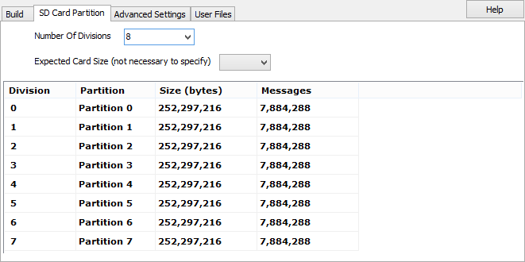

# Utilities: CoreMini Partitions

CoreMini Logging supports the use of Partitions on the micro SD Card. Partitions are configured in the CoreMini Console under the "SD Card Partition Table" tab. Partitions split the storage medium into parts so separate captures or events can be logged to different records. There are 2 options in this dialog, one for the number of divisions and another to specify the size of the card

Partitions are selected in the Expression Editor under Physical IO -> neoVI FIRE Misc -> Logging Buffer Index. This can be done through the use of a Script Function block. Valid values for the Buffer Index or Partition index are 0 to one less then the number of divisions set in the SD Card Partition table. For example if 8 Partitions are created, valid values are 0 to 7.
