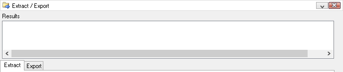

# Utilities: Extract / Export

The Tools -> Utilities -> Extract Export interface extracts data from standalone logger SD cards and exports that data to various file formats. Those two functions are divided into two major areas, each with its own tab, as shown in Figure 1.\
\
The Extract Tab reads Vehicle Spy Archive (VSA) files from the SD card and converts them into Vehicle Spy Binary (VSB) files on the PC.\
\
The Export Tab reads the extracted VSB files and converts them into various other signal or message file formats.

