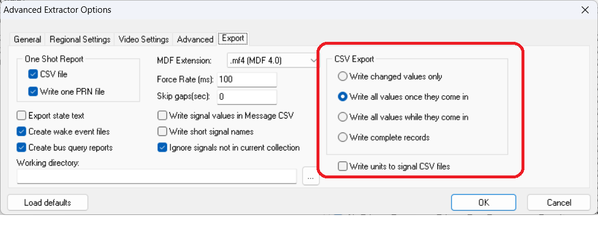

# How to convert VSB files to CSV format on windows using dataextract.exe tool.

#### How to convert VSB files to CSV format on windows using dataextract.exe tool.

Note: While CSV files are commonly used, they can consume a significant amount of time storage space on your hard drive.&#x20;

Place the vsb files and the vsdb database in some folder.

* Run the DataExtract.exe, switch to the Extract tab and Browse to the data directory:

<figure><figcaption></figcaption></figure>

* You may want to adjust just how much disk space you can do without, using the Advanced Options button and the Export tab:

<figure><figcaption></figcaption></figure>

Then they select CSV here:

<figure><figcaption></figcaption></figure>

and Click Export!
