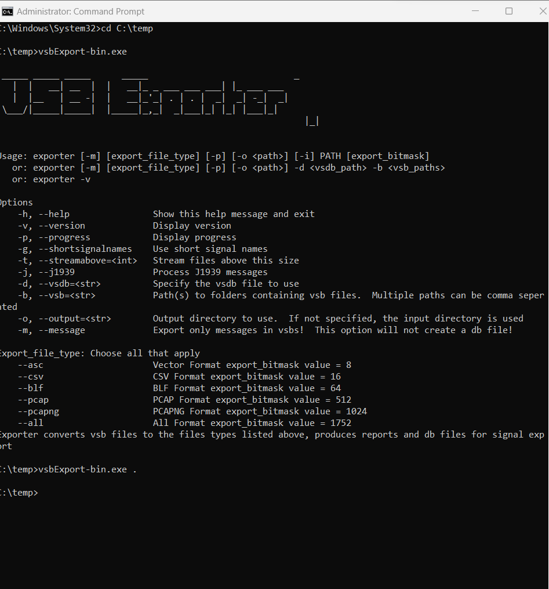

# Utilities: Export VSB Convert VSB (with VSDB) to Other Formats V using Command Prompt in Windows

#### Converting VSDB to MDF, Matlab CSV using Command Prompt in Windows

1. Download Required Files:&#x20;

&#x20;            a. Download vsbExport-bin.exe and dbExport-bin.exe, **Version 9.13.6-16226 or greater**

2. Prepare the Files and Folder:&#x20;

&#x20;           a. Create a new folder in a convenient location on your computer.\
&#x20;               Ex: `C:\Users\Desktop\MDF Matlab CSV Converter`

&#x20;           b. Place your .vsb and .vsdb file in the folder.&#x20;

&#x20;           c. Copy the downloaded vsbExport-bin.exe and dbExport-bin.exe files into the same folder.

<figure><figcaption></figcaption></figure>

3. Open Command Prompt
4. Navigate to the Directory           &#x20;

&#x20;           a. In the Command Prompt, use the cd command to navigate to the folder where&#x20;

&#x20;               you placed the files.&#x20;

&#x20;               For example: cd `"C:\Path\to\Your\Folder"`\
&#x20;               Ex: `C:\Users\Desktop\MDF Matlab CSV Converter`

5. Convert VSDB to db file:&#x20;

&#x20;           a. In the Command Prompt, type the following command and press Enter: **vsbExport-bin.exe**&#x20;

_Note: The dot "." specifies the current directory as the target for the script execution._

<figure><figcaption></figcaption></figure>

&#x20;     b. After executing the command, you should see a db file created in the same folder.

6. Convert TestData.db to CSV, MDF or Matlab format:

&#x20;      a. To convert the db file to CSV format, use the following command: **dbExport-bin.exe -e . 1**

<figure><figcaption></figcaption></figure>

&#x20;    b. To convert the db file to MDF format, use the following command: **dbExport-bin.exe -e . 2**

&#x20;     c.    To convert the db file to Matlab format, use the following command: **dbExport-bin.exe -e . 4**

7. After executing the command, a corresponding file will be created in the same directory, depending on the chosen format.

<figure><figcaption></figcaption></figure>
