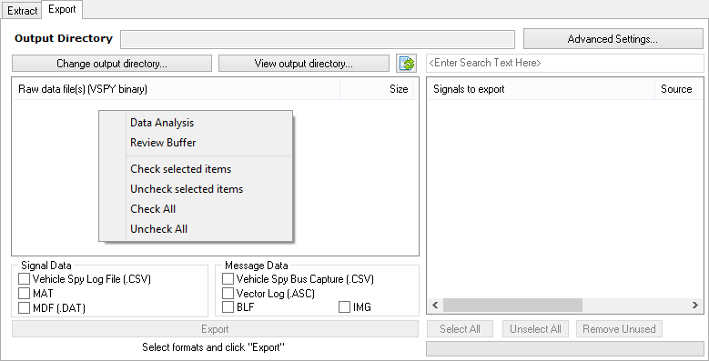

# Utilities: Export VSB to Other Formats

The second tab of the [Extract Export](./) interface (Figure 1) reads extracted VSB files and exports them into various other signal or message file formats.\
\
Follow these steps to export an extracted VSB file to another format:

1. [Extract](utilities-extract-from-sd-card.md) the VSB files from the SD card.
2. Verify the **Output Directory** is where the extracted VSB files are.
3. Select the VSB file to export in the raw data file list.
4. Pick a Signal or Message file format using the checkboxes.
5. If a Signal file format is used, select which signals to export.
6. Click the **Export** button to make the new file.
7. Watch the status under the Export button.

In the raw data VSB file list area there is a convenient right click menu available where an extracted VSB file can be quickly opened for further study with [Data Analysis](../../main-menu-measurement/data-analysis/) or [Review Buffer](../../main-menu-file/review-buffer.md).\
\
In the Signal Data checkbox area, the **Force Rate** value forces a periodic rate on all signal timestamps in the exported file. A value of -1 means the signal timestamps will be left untouched. That is, the signals in the exported file will use the timestamps from the VSB file.
