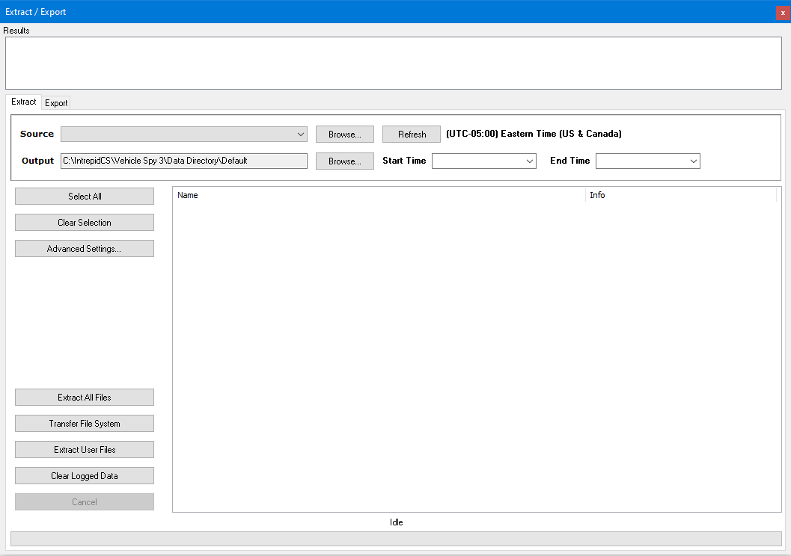
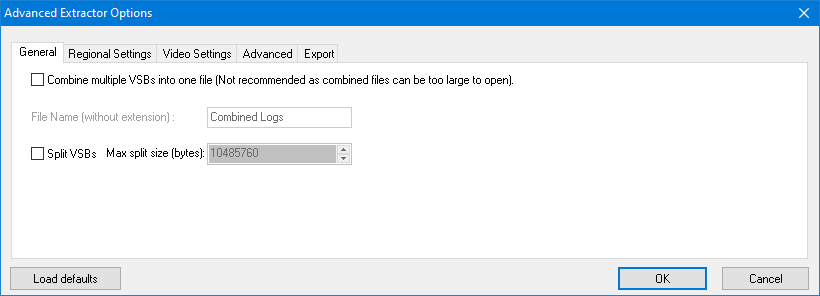
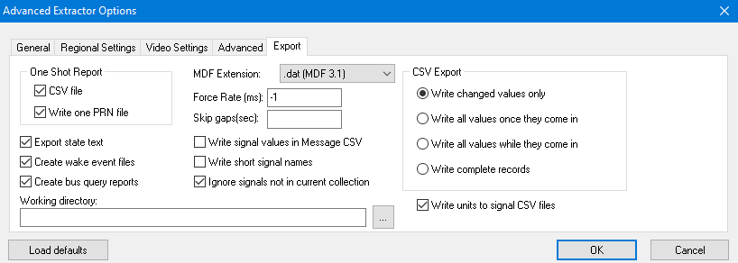

# Utilities: Extract from SD Card

The first tab of the Extract / Export interface (Figure 1) extracts data from standalone logger SD cards.\
\
Properly formatted SD cards are named "LOGGER" and have Vehicle Spy Archive (VSA) files on them that must be converted to Vehicle Spy Binary (VSB) files to be useful. The VSB files can then be used directly in Vehicle Spy or exported to other file formats.\
\
Follow these steps to pull data from an SD card and put VSB files on a PC:

1. Connect the SD card to the PC.
2. In **Source**, select the "LOGGER" SD card.
3. In **Output**, select where to put extracted VSB files on the PC.
4. If needed, adjust the start/end times or **Advanced Settings**.
5. Click the **Extract All Files** button to make the VSB files.
6. Watch the "Parsing results" area for status updates.

The **Clear Log Data** button will permanently clear all logged data from the SD card while leaving the CoreMini script intact.  A yes/no dialog will confirm the choice because THIS CAN NOT BE UNDONE!

### Advanced Extractor Options

The **Advanced Settings** button in Figure 1 above opens the dialog in Figure 2 below. The settings on the various tabs are briefly explained below. The **Load Defaults** button will revert all of the extractor settings back to their defaults.

### General tab:

Extracted files can be combined into one VSB file or split into limited size VSB files using the settings here.

### Regional Settings tab:

This allows the control of how the date and time will appear.  Changes to these settings also affect those found on the Tools-> Options->Regional Settings tab.

### Video Settings tab:

This allows modification of how video is extracted and saved if cameras are being used to log video alongside other data in the particular setup.

### Time Zone tab:

Logger data on the SD card is time stamped with UTC time (Universal Time Coordinated). The Time Zone selection here allows the choice to decide what the timestamps will be converted to in the extracted VSB files.

### Advanced tab:

Options in the Advanced tab are used for trouble shooting.  In most cases they will not be needed to be changed.

* Enable Pre/Post cropping (enabled by default) - When this option is enabled, data from standalone captures that are configured as Pre/Post collections are trimmed to include only the data that meets the time or message count it was configured for.  If this option is disabled, extra data before and after the trigger condition could be extracted.&#x20;
* Extract Older Records (disabled by default) - When data is extracted from the card, the timestamps are looked at to ensure the newest data is extracted.  This option is available to help pull data with older time stamps.&#x20;
* Continue Scanning Even if First Record is Blank (disabled by default) - This option is another trouble shooting option.  When this is enabled, the entire card is scanned to pull any data it find on the card.  Using this option takes much longer to scan and in most cases it is not needed.
* Ignore Timestamps (disabled by default) - If enabled, this option will pull all data regardless of the time stamp on the message and when the CoreMini script was loaded.  When disabled, only messages newer than when the CoreMini was loaded are extracted.
* Search All Records (disabled by default) - Turning this option on will search through the card for all possible records.  When disabled, it will stop when a set number of blank entries are received.  For normal operation, the blank entries serve as an end of collection.
* Force Most CAN Gateway to CAN (disabled by default) - For use with older setups.  If enabled it will force the MOST to CAN gateway to just CAN.
* Zero neoVI GPS Coordinates When Invalid (disabled by default) - When enabled, Invalid GPS data from the hardware is set to 0.

### Export tab:

Configurations for how data is exported and converted are made on the Export tab (Figure 3) of the Advanced Extractor Options.

* One Shot Report (Both checked by default) - This option gives the choice of using a \*.CSV, \*.PRN, or both for output of one shot collections.
* Export State Text (Enabled by default) - The way state encoded signals are represented are controlled through this option.  When checked, the state name is recorded rather than the state index.  This option only affects CSV type exports.
* Create Wake Events Files (Enabled by default) - When checked, Wake Event text files will be generated indicating when the hardware went to sleep during the collection time span.
* Create Bus Query Reports (Enabled by default) - Enabled, Bus query reports are generated when bus query collections are configured.
* MDF Extension (.dat is default) - The MDF file type has different data type outputs.  The Extension gives the option to select the file extension for MDF outputs.  Common file extensions are \*.DAT, \*.LOG, and \*.MDF.
* Write Signal Values in Message CSV (Disabled by default) - This option enables and disables adding signal information in message based CSV export files.  Excluding this information will decrease the output file size, but require a database when attempting to look at the signals in the messages.
* Write short signal names (Disabled by default) - When enabled, the signals are saved with their shorter names pulled from the database is applicable.
* Ignore Signals not in Current Collection (Enabled by default) - This option gives the choice to only exporting signals that were originally defined for that collection.
* Working directory - Allows the ability to change the directory where the extracted files will be saved to.
* CSV Export ("Write Changed Values only" by default) - The signal based CSV can be saved in a few different formats.  Different options will require different amounts of space to save.
  * Write Changed Values only - Only creates an entry for that signal when the data changes
  * Write All Values Once They Come In - Values only be added once the message is received.
  * Write All Values While They Come In - Values will only be during the duration that the message is active during the collection.
  * Write Complete Records - Uses the most space but has values entered in for every cell.&#x20;
