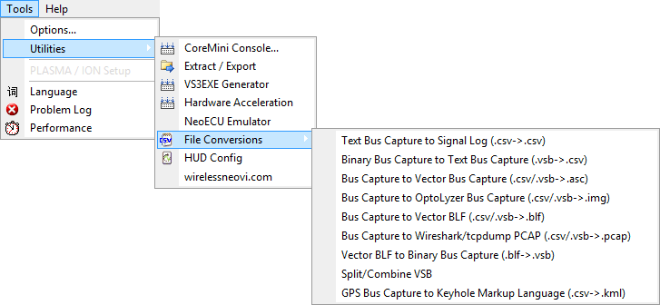

# Utilities: File Conversions

Vehicle Spy contains a few tools for converting file formats. To use them, select Tools -> Utilities -> File Conversions then select the conversion you want to perform (Figure 1). A window will pop up asking for a Vehicle Spy buffer file (CSV or VSB). Find the file and click Open. Another window will open for saving the converted file. Give the file a name and click Save.

Note that none of these file converters will change the original file. All of these converters work with a copy of the original file and leave the original untouched.

**Table 1: File Conversion Selections**

| File Conversion Selection                                         | Description                                                                                                                                                                                                                                                                                                                                        |
| ----------------------------------------------------------------- | -------------------------------------------------------------------------------------------------------------------------------------------------------------------------------------------------------------------------------------------------------------------------------------------------------------------------------------------------- |
| 
Text Bus Capture to Signal Log (.csv->.csv)
             | 
Converts a Vehicle Spy message+signal buffer file into a signal-only log file.  For example, use Messages view "Save" (with Save Signals enabled!) to capture a message+signal CSV file. Use this conversion utility on that file and it becomes a CSV log file with only signal values in it, just like Logging view would generate.
 |
| 
Binary Bus Capture to Text Bus Capture (.vsb->.csv)
     | 
Converts a Vehicle Spy binary buffer file into a Vehicle Spy CSV buffer file. (no signals)  For example, this can convert a VSB file captured from standalone logging into a CSV file for use in other programs.
                                                                                                                      |
| 
Bus Capture to Vector Bus Capture (.csv/.vsb->.asc)
     | Converts a Vehicle Spy message buffer file into a Vector? log file.                                                                                                                                                                                                                                                                                |
| 
Bus Capture to OptoLyzer Bus Capture (.csv/.vsb->.img)
  | Converts a Vehicle Spy message buffer file into an OptoLyzer? bus capture (img) file.                                                                                                                                                                                                                                                              |
| 
Bus Capture to Vector BLF Bus Capture (.csv/.vsb->.blf)
 | Converts a Vehicle Spy message buffer file into a Vector? bus capture (blf) file.                                                                                                                                                                                                                                                                  |

Though it is not on the File Conversions menu, the **CSV2KML** converter takes GPS position information from a Vehicle Spy log file and converts it into a KML file for Google Earth.\
\
The various file converters are necessary because Vehicle Spy can save buffer files in three formats. Each file format has these unique qualities that are useful in different situations:

### Bus Capture CSV buffer file

* always has message data
* can include OR not include decoded signal data as set by the user (database might be required)
* readable by many applications
* larger size than Signal Log or VSB files

### Signal Log CSV file

* never has message data
* always has decoded signal data (database not required)
* readable by many applications
* basic table of signals vs time

### Bus Capture VSB (binary) buffer file

* always has message data
* never has decoded signal data (database required)
* readable only by Vehicle Spy
* smaller size than CSV files
