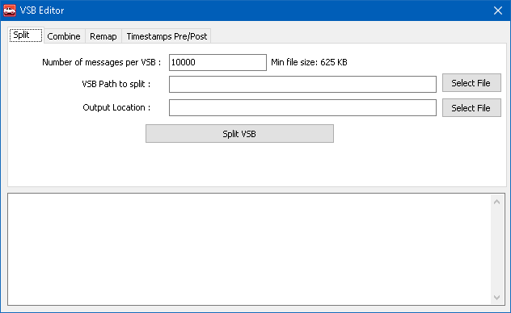
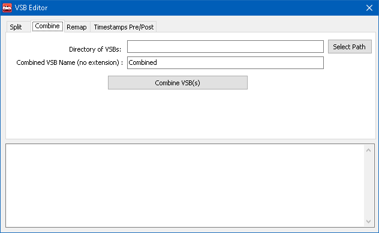
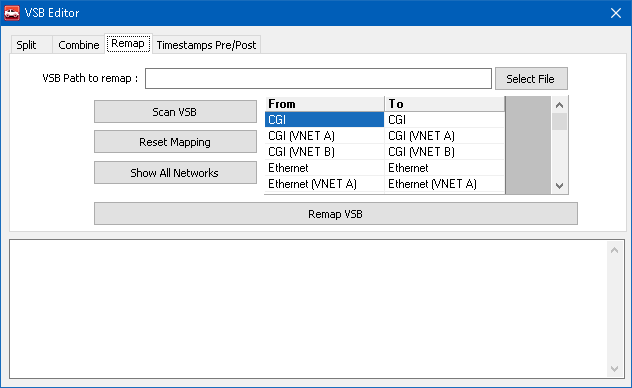
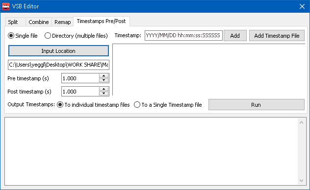

# VSB Editor

Vehicle Spy can save network message traffic to Vehicle Spy Binary (VSB) files using Messages view, capture function blocks, or Data Cache Disk Streaming.One benefit of the VSB file format is its smaller size compared to other file types.VSB files do NOT store decoded signals or user notes.Also, VSB files are not easy to read with standard file editors; so use File > Review Buffer to read them.

VSB files can be changed with the VSB Editor in the following ways:

* Split one VSB file into smaller files.
* Combine multiple VSB files into one file.
* Remap networks within a VSB file.

The VSB Editor is opened from the Tools > File Conversions menu.

### Split VSB

Use the Split VSB tab (Figure 1) to split one VSB file into multiple smaller VSB files:

1. Enter the **Number of messages per VSB** to set how big each of the split files will be.
2. Click **Select File** and pick the VSB source file to split.
3. Click the second **Select File** and pick the Output Location for the split VSB file.
4. Click **Split VSB** to split the file according to the settings made.

The bottom area shows the status of split actions being performed. Vehicle Spy puts the split VSB files in the same directory as the source file.Each split file name is the source file name appended with a sequence number.

### Combine VSBs

Use the Combine VSBs tab (Figure 2) to combine all VSB files within a directory into one VSB file:

1. Click **Select Path** and pick the directory that has the VSB source files to combine.
2. Enter a **Combined VSB Name** (without extension) for the final combined file.
3. Click **Combine VSBs** to pull the files together.

The bottom area shows the status as the VSB files are joined together.Vehicle Spy puts the combined VSB file in the same directory as the source files.

### Remap VSB

Use the Remap VSB tab (Figure 3) to change network assignments within a VSB file:

1. Click **Select Path** and pick the VSB file to be remapped.
2. Click **Scan VSB** to update the "From" column with the networks currently in the VSB file.
3. Select desired networks in the "To" column. (Figure 1:)
4. If needed, use **Reset Mapping** to reset all "To" networks back to their original "From" settings.
5. Click **Remap VSB** to make a new VSB file with the remapped networks in the "To" column.

The bottom area shows the status of remapping actions being performed.Vehicle Spy puts the remapped VSB file in the same directory as the source file.The remapped VSB file name is the source file name appended with the text "Remapped" to avoid overwriting the original file.

**Show All Networks** is not needed for remapping a VSB file, so do not use it.

### Timestamps Pre/Post

Use the Timestamps Pre/Post (Figure 4) to edit a VSB file based on a trigger time:

1. Click **Single File** or **Directory (multiple files)** to edit either a single file, or all the files in a directory
2. Enter a timestamp and click **Add**, or click on **Add Timestamp File** to add a timestamp to be used to evaluate Pre/Post times.
3. Click on **Input Location** to select either a file if **Single File** is selected, or a directory if **Directory (multiple files)** is selected.
4. Set the Pre and Post trigger times to be captured under **Pre timestamp (s)** and **Post timestamp (s)** respectively
5. Select **To individual timestamp files** to capture each trigger event to a seperate file, or select **To a Single Timestamp file** to capture all trigger events as one file.
6. Click on **Run** to edit the selected VSB file to the parameters set above.

The bottom area shows the status of the Pre/Post collection as it is being processed.

