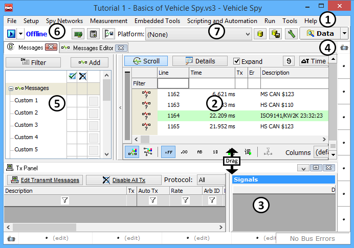

# Getting Comfortable with the User Interface

Before beginning actual lessons and exercises, it is important to get familiar with the Vehicle Spy interface. It has been designed to be easily navigated and intuitive. The Vehicle Spy Interface is divided into multiple panels as shown in **Figure 1**.

**Menu Bar** (Figure 1:): Across the top of the Vehicle Spy interface is a standard format menu bar. The Menu Bar contains the heading for File, Setup, Spy Networks, Measurement, Embedded Tools, Scripting and Automation, Run, Tools, and Help. From the Menu Bar it is possible to access all the features of Vehicle Spy. The Menu bar also contains the Data button. This buttons allow for fast access to user data files. Working with Vehicle Spy, you will also see a set of tabs build up in the Menu Bar. These tabs are used to control the view displayed in the Main Workspace. When a view is chosen through the Menu Bar, a tab for that view will automatically appear. (In Figure 1, the Messages view tab is visible.) Tabs can be closed by clicking the "x" in the tab itself. Customizable tab sets allows each user to create an interface that best suits their individual needs.

**Main Workspace Panel** (Figure 1:): The majority of the Vehicle Spy user interface is devoted to the Main Workspace Panel. It is where the Logon Screen appears when Vehicle Spy is started and where most activity occurs. The view shown in the Main Workspace changes based on the view selected. Different views are selected by selecting the group (Spy Networks, Measurement, Embedded Tools, or Scripting and Automation) from the Menu Bar.

**Alternate Workspace Panels** (Figure 1: & ): Often times, it is necessary to see multiple views simultaneously. To accommodate this, Vehicle Spy provides two Alternate Workspace panels. These panels are docked along the bottom and the right side of the Vehicle Spy Interface. They function in the same way as the Main Workspace panel. Each Alternate Workspace has a customizable set of tabs.

**Filter Panel** (Figure 1:): To the left of the Main Workspace is the Filter Panel. This panel is only available when the Messages view is selected. This panel is used to activate the many filtering capabilities found in Vehicle Spy.

**Quick Setup Buttons** (Figure \*\*\*\* 1:): When jumping from project to project, it may be necessary to change network and hardware settings. The Quick Setup buttons are a quick link to those common views in Vehicle Spy.

**Platform Selection and configuration buttons** (Figure 1:): This dropdown gives quick access to all the configured database and database options.

All of these panels can be opened, closed, moved, resized, and even torn from the main window based on user preference. To resize, move the mouse over the dark lines between the panels until the mouse cursor turns into a pair of arrows. Just click, drag, and release when panel is the desired size. Note the  indicator in **Figure 1**.

Please check the following video for more details.



