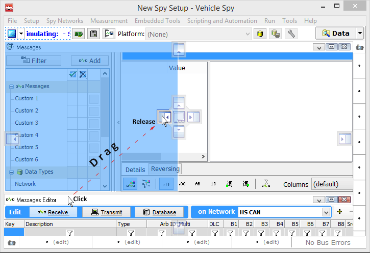

# Tabs in the User Interface

To help increase productivity, Vehicle Spy 3 has the ability to tear tabs from the main workspace. With this feature, views can be placed where they will be the most useful.

#### Tearing and Docking Tabs (Figure 1):

Tabs in Vehicle Spy can be "torn off" or removed from the main window. This comes in handy when needing to see a number of different views at the same time or if different windows on different parts of the screen would be helpful. Tabs are removed from the main window by clicking on the tab or view and dragging it away. To dock a tab, move selected tab toward desired view. A dock option will appear. Placing the mouse over the desired dock option and releasing will snap it to the other view. The highlighted blue area is where the view will go after the mouse button is released. To prevent docking the view, but allow it to move it elsewhere, hold **Ctrl** on the keyboard while dragging.

