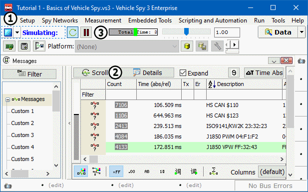

# Part 2 - Monitor Message Traffic

### 1. Select Messages View:

The **Messages** view should already be loaded in the main workspace. If it is not, using the **Menu Bar**, select **Spy Networks > Messages**. Vehicle Spy will always create a tab based on view selection.&#x20;

### 2. Start Vehicle Spy:

Select the blue **Start** button (Figure 1:) located in the upper left corner of the interface. Changing data should appear instantly in the main workspace and the **Start** button will change into a **Stop** button.  If this has not happened, the simulation file **All Bus Traffic.csv** will have to be located by selecting the pull down menu to the right of the  **Start** button (Figure 1:) and selecting **Run Simulation > Browse.**

### 3. Observe Message Traffic:

The data seen in the display has been previously recorded.  It is being replayed for the purposes of this tutorial.  This is referred to as "Simulation Mode".  This is indicated by blue text adjacent to the blue start/stop button.  "Simulation Mode" allows you to explore features and experiment without having network hardware or being connected to a vehicle.\
\
**Messages** has two modes: "Scrolling" and "Static".  Toggle between these modes by selecting the **Scroll** button (Figure 1:) located in the upper left. Pressing this button allows view of the stream of messages flying by.  Select the **Pause** button (Figure **** 1:) along the top of this panel to stop the scrolling without stopping Vehicle Spy.\
\
With the messages playing, select the **Scroll** button again to see a static view of the messages.  All messages that have been detected at least once are listed.  Messages that have recently changed are highlighted in gray.  Messages that were present on the bus at least once but have not changed since are first highlighted in blue and then gradually fade to white.

### 4. Stop Vehicle Spy:

After becoming comfortable with how data appears in **Messages**, click the blue **Stop** button (Figure 1:) to stop Vehicle Spy traffic.
