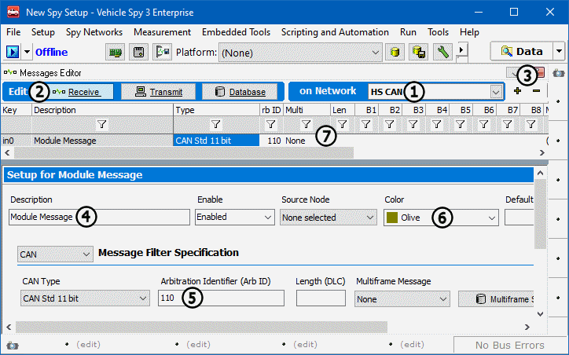

# Part 3 - Examine Messages

The Messages view can be set up to display precisely what needs to be seen. It can be customized for any need and can display specific messages in message traffic. In the next couple steps a basic message specification will be set up. This is a good place to begin exploring Vehicle Spy's filtering capabilities.

### 1. Switch to Messages Editor View:

From the Menu Bar select **Spy Networks > Messages Editor**. The panel in the main workspace changes from the **Messages** view to the **Messages Editor** view.

### 2. Create a New Message Specification:

For this exercise specify a received High Speed CAN message. Select **HS CAN** from the **Network** dropdown (Figure 1:) and check that the **Receive** tab (Figure 1:) is selected. Now click the **+ button** (Figure 1:) at the top of the panel to create a new message specification. (Specifications can be removed just as easily. With Vehicle Spy stopped, simply select the row to be removed and click the **- button** (Figure 1:).) We will define our new specification using the Setup dialog.

### 3. Enter Module Message in the Description Field:

Attach a description to the message. Label it **Module Message** inside the **Description** field (Figure 1:) in the Setup dialog.

### 4. Enter an Arbitration ID of 110:

Now enter an arbitration ID of 110 into the **Arb ID** field (Figure 1:). This attaches the "Module Message" description to messages with Arb ID 110.

### 5. Give the Message a Color:

With so many messages flying by, custom colors make instant visual identification possible. Select the **Color** dropdown field (Figure 1:) and choose desired color.

### 6. Examine Completed Message:

Examine message in the grid portion of the Messages Editor panel (Figure 1:). All the specifications entered in the Setup dialog are automatically added to the spreadsheet. Make sure message looks exactly like the one found above in **Figure 1**. (For a more complete explanation of the options found in the Setup dialog, please [click here](https://cdn.intrepidcs.net/support/VehicleSpy/spyIncomingMessages.htm).)\
\
**\*Note:** Depending on preference, message information such as Description or Arb ID can be entered directly into the grid or in the Setup dialog. The changes made in one area will also occur in the other.
