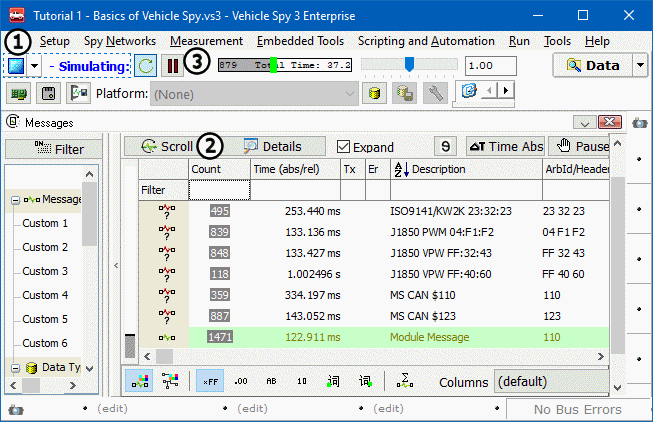

# Part 4 - Your Message Specification in Action

With a message specification set up, it will be visible in the Messages view.

### 1. Open Messages View:

Use custom tab set at the top of the main workspace to switch back to **Messages** view.

### 2. Start Vehicle Spy:

Click the **Start** button (Figure 1:) located in the upper left corner.

### 3. Enter Scroll Mode:

Press the **Scroll** button (Figure 1:). Notice the **Module Message** description is present, attached to HS CAN messages with Arb ID 110. Select the **Pause** button (Figure 1:) to see this more easily.

### 4. Enter Static Mode:

Turn scrolling off by clicking the **Scroll** button again. Module Message is displayed in the custom color you selected. Notice the data in the message is changing. This can be spotted easily because of the gray activity highlighting.

**\*Note:** It is unnecessary to Stop traffic or go off-line to edit in Vehicle Spy.
