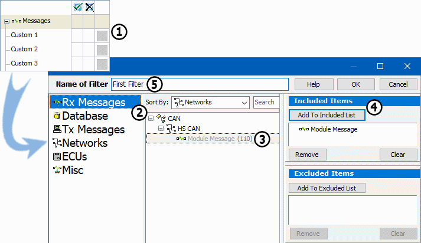

# Part 5 - Filtering Messages

A complete message specification is the basic building block of a custom filter. In this part of Tutorial 1, you will create your own custom filter.

### 1. Open theMessages View:

Select the **Messages** tab. When the panel opens, notice the Filter Bar that appears automatically on the left side. This is a convenient way to turn on and off all sorts of filters you may use in your applications. Notice the "Custom 1" heading in the list and select the small blank box to the right of the heading (Figure 1:). This opens up the Setup Filter dialog where filters are defined.

### 2. Create Custom Filter:

The Setup Filter dialog makes it easy to quickly set up a filter. At the left side of the dialog is a list of message sources. This enablesaccess to messages defined in the Messages Editor, entered in your database, etc. Make sure that the **Rx Messages** option is selected (Figure 1:). Notice that Module Message appears in the list under High Speed CAN (Figure 1:). Vehicle Spy automatically places every message defined in its appropriate place to make workflow as efficient as possible. Highlight **Module Message** and then click the **Add to Included** List button (Figure 1:). This adds Module Message to your filter.

### 3. Name Filter:

When working with multiple filters, specifying names can help to keep things organized. Double click inside the "Name of Filter" field and name this filter "First Filter" (Figure 1:). When finished, click the **OK** button to return to the Messages view.

### 4. Activate Filter:

Now take a close look at the filter bar. The Custom 1 heading has been replaced by **First Filter**. Make sure that Vehicle Spy is started and then click inside the first column to the right of the filter name (Figure 2:). A green check mark appears in the column, the First Filter text turns green, and message traffic changes dramatically. Instead of seeing all messages on the bus, only Module Message is seen.

### 5. Adding Extra Custom Filters:

If extra custom filters are needed, the **Add** button above the filter bar (Figure 2:) can be clicked to create extra custom filters. Extra custom filters can be removed by right clicking on the filter and selecting **Remove Message Filter**.

### 6. Exclusion Filtering:

When using filters in Vehicle Spy, messages can also be excluded. In order for this to work properly, something must always be included before exclusion is possible. Vehicle Spy looks for included messages first and then excludes from that list. For example, removing our Module Message from the message traffic. First place a green checkmark next to the **Network** heading (Figure 3:) under Data Types in the Filter Panel. This will filter to include all network traffic. Next click in the second column to the right of the **First Filter** heading (Figure 3:). An X fills the column, First Filter text is now red, and Module Message is excluded from the message traffic.

Experiment with the Filter panel for a little while. Try including all network traffic and then excluding all HS CAN messages. Try to include all HS CAN messages and exclude Module Message. The Filter panel provides endless ways to customize the view of the data.
